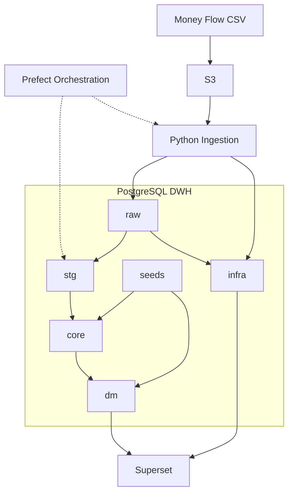

# Finance Analytics Platform

[](https://github.com/w3llnamed/finance_analytics/actions/workflows/ci.yml) 

Personal finance analytics platform built with PostgreSQL, dbt, Python and Superset.

The project implements a layered DWH architecture (`raw - stg - core - dm`), ingestion observability, dbt testing and BI dashboards for financial analysis and data quality monitoring.


## Table of Contents

- [Finance Analytics Platform](#finance-analytics-platform)
  - [Table of Contents](#table-of-contents)
  - [Project Status](#project-status)
  - [Features](#features)
    - [Data Ingestion](#data-ingestion)
    - [Data Warehouse](#data-warehouse)
    - [Orchestration and Observability](#orchestration-and-observability)
    - [Analytics and Deployment](#analytics-and-deployment)
  - [Deployment](#deployment)
  - [Architecture](#architecture)
  - [Tech Stack](#tech-stack)
  - [Continuous Integration](#continuous-integration)
  - [External Storage and Ingestion](#external-storage-and-ingestion)
  - [Project Structure](#project-structure)
  - [Data Flow](#data-flow)
  - [Dashboards](#dashboards)
  - [Optional Demo Environment](#optional-demo-environment)
  - [Requirements](#requirements)
  - [Environment Setup](#environment-setup)
    - [Optional Host Development Environment](#optional-host-development-environment)
    - [Optional Host dbt Profile](#optional-host-dbt-profile)
  - [Quick Start](#quick-start)
    - [Deploy the Prefect Flow](#deploy-the-prefect-flow)
    - [Run dbt Manually](#run-dbt-manually)
    - [Run Ingestion Manually](#run-ingestion-manually)
    - [Open the Interfaces](#open-the-interfaces)
  - [Roadmap](#roadmap)


## Project Status

Active development.

Current implementation includes:
- S3-based ingestion pipeline
- Prefect orchestration
- layered DWH transformations
- observability marts
- dbt tests
- Superset dashboards
- Docker-based analytics environment
- GitHub Actions continuous integration


## Features

### Data Ingestion

- Automated ingestion pipeline from CSV files through S3 into PostgreSQL
- Scheduled S3 polling and processing of newly uploaded files
- Idempotent file processing backed by an ingestion registry
- Automatic dbt execution after successful data ingestion

### Data Warehouse

- Layered warehouse architecture with `raw`, `stg`, `core`, `dm`, and `infra` schemas
- Reusable dbt transformations, data tests, and documentation
- Analytics-ready data marts for financial reporting

### Orchestration and Observability

- Workflow orchestration and scheduling with Prefect
- Ingestion freshness and file-processing monitoring
- Historical tracking of dbt model runs and test results
- Infrastructure-level data quality dashboards

### Analytics and Deployment

- Interactive BI dashboards built with Apache Superset
- Containerized local and server deployment with Docker Compose
- Automated PostgreSQL database, role, and permission initialization


## Deployment

The platform is deployed as a Docker Compose environment.

The same containerized services can be started locally or on a Linux server. However, public server deployment additionally requires host-level configuration such as a firewall, DNS, a reverse proxy and HTTPS.

Current containerized services include:

- PostgreSQL 16 — analytical storage and layered DWH
- Apache Superset — BI and observability dashboards
- Prefect PostgreSQL — orchestration metadata database
- Redis 7 — Prefect messaging broker and cache
- Prefect Server — orchestration API and user interface
- Prefect Services — background Prefect server services
- Prefect Worker — execution of scheduled ingestion and dbt flows

On the first startup of an empty analytical PostgreSQL volume, bootstrap scripts initialize:

- database roles
- schemas
- grants
- raw ingestion tables
- infra monitoring tables

Superset is deployed as a custom Docker image with additional analytical dependencies:

- `psycopg2-binary`
- `prophet`

Persistent Docker volumes preserve:

- PostgreSQL analytical data
- Superset metadata, users and dashboard configuration
- Prefect orchestration metadata

**The commands in the Quick Start section describe a local deployment**. Public server deployment is configured separately at the operating-system and reverse-proxy level (`docs/deployment/vps.md`)

The documented public VPS deployment uses Caddy as a host-level reverse proxy.

Caddy terminates HTTPS connections, manages TLS certificates and forwards
public requests to Superset on `127.0.0.1:8088`.

Caddy is not part of the Docker Compose stack.

## Architecture



The seed layer contains both public reference data and private user-specific configuration.

Public seeds are committed to the repository, while private seed files are excluded because they contain user-specific financial metadata.

Example templates are provided to document the required structure.


## Tech Stack

- PostgreSQL
- dbt
- Python
- Prefect
- Apache Superset
- Docker and Docker Compose
- S3-compatible object storage (Timeweb S3)
- Caddy — production reverse proxy and automated HTTPS
- GitHub Actions — continuous integration
- SQLFluff — dbt-aware SQL linting


## Continuous Integration

The repository uses GitHub Actions to validate changes automatically on pushes
and pull requests targeting the `main` branch.

The CI pipeline performs:

- pre-commit checks
- Docker Compose configuration validation
- Superset Dockerfile and Python configuration checks
- Prefect Worker image build and dependency validation
- Prefect flow import and work pool readiness checks
- dbt connection validation against an isolated CI PostgreSQL instance
- SQLFluff linting with the dbt templater
- a complete `dbt build` using synthetic CI data

The CI environment does not use production credentials or production financial
data.

Synthetic source data and CI-specific configuration are stored under:

```
tests/ci/
```

Workflow configuration and detailed CI documentation are stored under:

```
.github/workflows/
```

## External Storage and Ingestion

Raw Money Flow CSV exports are stored in S3-compatible object storage before being loaded into PostgreSQL.

The current ingestion flow is:

1. Money Flow CSV export is uploaded to S3.
2. A Python ingestion script reads the CSV file from S3.
3. The script loads the data into the `raw.money_flow` table.
4. Metadata about each loaded file is written into `infra.ingestion_file_registry`.
5. dbt models consume only the latest successful ingestion batch from the raw layer.

S3 is not accessed directly by dbt. dbt works with PostgreSQL tables only.


## Project Structure

Main repository structure:

```
├── .github/
│   └── workflows/        # GitHub Actions CI workflow and documentation
│
├── dbt/                  # dbt project: transformations, tests, seeds and macros
│   ├── analyses/         # ad-hoc analytical SQL queries
│   ├── macros/           # custom dbt macros
│   ├── models/           # layered DWH models: sources, stg, core, dm and infra
│   ├── seeds/            # static reference data
│   ├── snapshots/        # dbt snapshots, reserved for future historical tracking
│   └── tests/            # custom dbt data tests
│
├── docs/                 # project documentation and exported BI assets
│   └── superset_exports/ # exported Superset dashboards
│
├── infra/                # infrastructure SQL and deployment configuration
│   ├── bootstrap/        # database roles, schemas, grants, raw and infra tables
│   └── deploy/           # Docker Compose, Superset and Prefect deployment configuration, Caddy configuration
│
├── ingestion/            # Python ingestion layer for loading Money Flow CSV files
│
├── orchestration/        # Prefect orchestration layer
│   └── flows/            # Prefect flow definitions
│
├── tests/
│   └── ci/               # synthetic data and CI-specific test configuration
│
├── prefect.yaml          # Prefect deployment configuration
├── requirements.txt      # Python dependencies
├── README.md             # project overview
│
├── docs/
```


## Data Flow

1. The user exports financial transactions from the Money Flow mobile application in CSV format.

2. CSV files are uploaded to S3-compatible object storage (Timeweb S3).

3. Prefect periodically runs the orchestration flow.

4. The orchestration flow checks S3 for available Money Flow CSV files and validates whether the latest file has already been processed using `infra.ingestion_file_registry`.

5. If the file is new, the ingestion layer loads it into the `raw` layer in PostgreSQL and writes ingestion metadata into `infra.ingestion_file_registry`.

6. If the file has already been processed, the flow exits without running downstream transformations.

7. After successful ingestion, Prefect triggers dbt transformations and tests.

8. dbt builds layered models:

   - `raw` — source-level ingested data
   - `stg` — technically normalized source data from the latest successful ingestion batch
   - `core` — canonical business entities with unified transaction logic, transfer expansion and dimensional enrichment
   - `dm` — analytical marts and KPI-ready datasets
   - `infra` — observability and platform monitoring models

9. Observability models track:

   - ingestion freshness
   - dbt test results
   - model execution history
   - data quality metrics

10. Superset dashboards consume `dm` and `infra` models for financial analytics and platform monitoring.


## Dashboards

Current dashboards include:

- Expenses analytics
- Income analytics
- Balance tracking
- Data Quality / Observability

Expense and income charts are based on dates present in the transaction data
rather than on a generated calendar spine. When daily granularity is selected,
**days without financial operations are absent** from the dataset instead of being
represented as explicit zero values.

This behavior is primarily visible at daily granularity. At higher levels,
transactions are grouped into weeks, months or years.

Regular and reserve-related expense filters rely on transaction tags configured
in the `regular_expense_tag.csv` and `reserve_expense_tag.csv` dbt seeds.

Transactions without the corresponding source tags cannot be selected through
these expense-type filters.

Dashboard is optimized for desktop browsers and is designed for a Full HD (1920×1080) viewport.


## Optional Demo Environment

**The demo environment is optional and is not required for a private personal deployment.**

The project optionally includes a separate anonymized analytical mart for public demonstration purposes:

- `dm__fact_transaction_demo`

The demo mart is built from the same canonical transaction model as the main analytical mart, but replaces sensitive financial attributes with demo values.

The anonymization process includes:

- replacing real account names with demo account names
- replacing real categories and parent categories with demo mappings
- adjusting transaction amounts using category-level masking coefficients
- removing transaction tags and notes
- preserving transaction structure, transaction types and analytical flags

This allows the public dashboard to demonstrate the analytical logic and dashboard functionality without exposing personal financial data.

The demo environment is disabled by default through:

```
DBT_ENABLE_DEMO=False
```

When the demo environment is disabled:

- models in dbt/models/04_dm_demo are excluded from the dbt project
- demo-specific data tests are not executed
- category_mapping_demo.csv is not required
- a standard dbt build creates only the private analytical environment

To enable the demo environment, set the following value in `infra/deploy/.env:`

```
DBT_ENABLE_DEMO=True
```

When enabled, the demo category mapping seed becomes required and the dbt build validates its completeness before creating the demo mart.


## Requirements

Required for Docker-based deployment:

- Docker Engine
- Docker Compose plugin
- Git

Python, Prefect, dbt and the project runtime dependencies are installed inside
the Prefect Worker Docker image during the image build.

For development tools and direct execution outside Docker, the host system
additionally requires:

- Python 3.12
- Python virtual environment support


## Environment Setup

Clone the repository:

```
git clone <repo_url>
cd finance_analytics
```

Create the runtime environment file:

```
cp infra/deploy/.env.example infra/deploy/.env
```

Open `infra/deploy/.env` and replace all placeholder values with the required
runtime credentials and configuration.

The `.env` file contains sensitive values, is excluded from version control
and must not be committed.

Create the required private account seed:

```
cp dbt/seeds/private/dim_accounts.csv.example \
   dbt/seeds/private/dim_accounts.csv
```

Replace the example rows with the required account metadata and opening balances.

The optional anonymized demo environment is disabled by default.

To enable it, set the following value in `infra/deploy/.env`:

```
DBT_ENABLE_DEMO=True
```

Then create the private demo category mapping:

```
cp dbt/seeds/private/category_mapping_demo.csv.example \
   dbt/seeds/private/category_mapping_demo.csv
```

Replace the example rows with the required category mappings and masking parameters.

The public `dim_accounts_demo.csv` seed is already included in the repository.
Its `account_id` values must match the identifiers used in the private
`dim_accounts.csv` file.

When `DBT_ENABLE_DEMO=False`, the demo models and demo-specific tests are
excluded from the dbt project and category_mapping_demo.csv is not required.


### Optional Host Development Environment

A host-level Python virtual environment is not required for Docker-based
deployment.

It is used only when Python scripts, dbt, Prefect CLI or development tools are
executed directly on the host instead of inside the Prefect Worker container.

Create the optional development environment:

```
python3 -m venv .venv
source .venv/bin/activate
pip install -r requirements.txt
```

Install the repository pre-commit hooks:

```
pre-commit install
```

Run all configured checks:

```
pre-commit run --all-files
```

### Optional Host dbt Profile

The host-level dbt profile is required only when dbt is executed directly on
the host:

```
mkdir -p ~/.dbt
cp dbt/profiles.yml.example ~/.dbt/profiles.yml
```

When dbt runs inside the Prefect Worker container, database connection values
are supplied through Docker Compose environment variables.


## Quick Start

Complete the environment setup before starting the containers.

Build and start the complete Docker environment:

```
cd infra/deploy
docker compose up -d --build
```

The command starts:

- PostgreSQL 16
- Apache Superset
- Prefect PostgreSQL
- Redis
- Prefect Server
- Prefect Services
- Prefect Worker

The `--build` option builds or rebuilds the custom Docker images before
starting the containers. During the Prefect Worker image build, Python project
dependencies are installed from the repository `requirements.txt` file.

On the first startup of an empty analytical PostgreSQL volume, bootstrap
scripts initialize:

- database roles
- schemas
- grants
- raw ingestion tables
- infra monitoring tables

Check the service status:

```
docker compose ps
```

### Deploy the Prefect Flow

Run the deployment command inside the Prefect Worker container:

```
docker exec -it \
  -w /opt/finance_analytics \
  prefect-worker \
  prefect deploy
```

The command reads `prefect.yaml` from the project root inside the container
and creates or updates the Prefect deployment.

The Prefect Worker automatically creates the `finance-process-pool` work pool
when necessary and polls it for scheduled flow runs.

### Run dbt Manually

Run the full dbt build inside the Prefect Worker container:

```
docker exec -it \
  -w /opt/finance_analytics/dbt \
  prefect-worker \
  dbt build
```

The working directory is set to `/opt/finance_analytics/dbt` because this is
where `dbt_project.yml` is located.

### Run Ingestion Manually

Run the ingestion script inside the Prefect Worker container:

```
docker exec -it \
  -w /opt/finance_analytics \
  prefect-worker \
  python ingestion/load_money_flow_from_s3.py
```

### Open the Interfaces

Superset:

```
http://localhost:8088
```

Prefect:

```
http://localhost:4200
```

Exported Superset assets are stored in:

```
docs/superset_exports/
```

Import them through the Superset user interface after the services have started.


## Roadmap

Planned improvements:

- Multi-currency transaction and balance support
- AI-powered analytics assistant
- Alerting and anomaly detection
