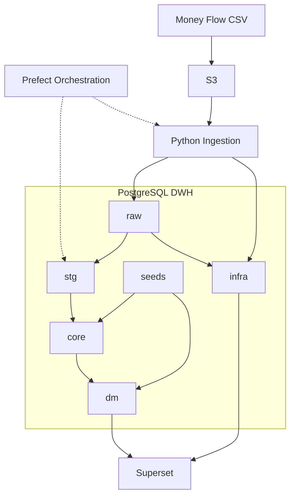

# Finance Analytics Platform

Personal finance analytics platform built with PostgreSQL, dbt, Python and Superset.

The project implements a layered DWH architecture (`raw → stg → core → dm`), ingestion observability, dbt testing and BI dashboards for financial analysis and data quality monitoring.


## Project Status

Active development.

Current implementation includes:
- S3-based ingestion pipeline
- Prefect orchestration
- layered DWH transformations
- observability marts
- dbt tests
- Superset dashboards
- Docker-based analytics environment


## Features

### Data Ingestion

* Automated ingestion pipeline from CSV files through S3 into PostgreSQL
* Scheduled S3 polling and processing of newly uploaded files
* Idempotent file processing backed by an ingestion registry
* Automatic dbt execution after successful data ingestion

### Data Warehouse

* Layered warehouse architecture with `raw`, `stg`, `core`, `dm`, and `infra` schemas
* Reusable dbt transformations, data tests, and documentation
* Analytics-ready data marts for financial reporting

### Orchestration and Observability

* Workflow orchestration and scheduling with Prefect
* Ingestion freshness and file-processing monitoring
* Historical tracking of dbt model runs and test results
* Infrastructure-level data quality dashboards

### Analytics and Deployment

* Interactive BI dashboards built with Apache Superset
* Containerized local and server deployment with Docker Compose
* Automated PostgreSQL database, role, and permission initialization


## Deployment

The platform uses a Docker-based local analytics environment.

Current containerized services include:

- PostgreSQL 16 — analytical storage and layered DWH
- Apache Superset — BI and observability dashboards
- Prefect PostgreSQL — orchestration metadata database
- Redis 7 — Prefect messaging broker and cache
- Prefect Server — orchestration API and user interface
- Prefect Services — background Prefect server services
- Prefect Worker — execution of scheduled ingestion and dbt flows

The PostgreSQL container automatically initializes:

- database roles
- schemas
- grants
- raw ingestion tables
- infra monitoring tables

Superset is deployed as a custom Docker image with additional analytical dependencies:

- `psycopg2-binary`
- `prophet`

Persistent Docker volumes are used to preserve:

- PostgreSQL analytical data
- Superset metadata, users and dashboard configuration
- Prefect orchestration metadata


## Architecture



The seed layer contains both public reference data and **private mappings**.
Public seeds are committed to the repository, while private account and
category mappings are excluded because they are derived from personal
financial data. The private seed directory includes tracked example files
that document the required structure.


## Tech Stack

- PostgreSQL
- dbt
- Python
- Prefect
- Apache Superset
- Docker and Docker Compose
- S3-compatible object storage (Timeweb S3)
-

## External Storage and Ingestion

Raw Money Flow CSV exports are stored in S3-compatible object storage before being loaded into PostgreSQL.

The current ingestion flow is:

1. Money Flow CSV export is uploaded to S3.
2. A Python ingestion script reads the CSV file from S3.
3. The script loads the data into the `raw.money_flow` table.
4. Metadata about each loaded file is written into `infra.ingestion_file_registry`.
5. dbt models consume only the latest successful ingestion batch from the raw layer.

S3 is not accessed directly by dbt. dbt works with PostgreSQL tables only.


## Project Structure

Main repository structure:

```
├── dbt/                  # dbt project: transformations, tests, seeds and macros
│   ├── analyses/         # ad-hoc analytical SQL queries
│   ├── macros/           # custom dbt macros
│   ├── models/           # layered DWH models: sources, stg, core, dm and infra
│   ├── seeds/            # static reference data
│   ├── snapshots/        # dbt snapshots, reserved for future historical tracking
│   └── tests/            # custom dbt data tests
│
├── docs/                 # project documentation and exported BI assets
│   └── superset_exports/ # exported Superset dashboards
│
├── infra/                # infrastructure SQL and deployment configuration
│   ├── bootstrap/        # database roles, schemas, grants, raw and infra tables
│   └── deploy/           # Docker Compose, Superset and Prefect deployment configuration
│
├── ingestion/            # Python ingestion layer for loading Money Flow CSV files
│
├── orchestration/        # Prefect orchestration layer
│   └── flows/            # Prefect flow definitions
│
├── prefect.yaml          # Prefect deployment configuration
├── requirements.txt      # Python dependencies
├── README.md             # project overview
├── CHANGELOG.md          # project changelog
└── TODO.md               # project backlog
```


## Data Flow

1. The user exports financial transactions from the Money Flow mobile application in CSV format.

2. CSV files are uploaded to S3-compatible object storage (Timeweb S3).

3. Prefect periodically runs the orchestration flow.

4. The orchestration flow checks S3 for available Money Flow CSV files and validates whether the latest file has already been processed using `infra.ingestion_file_registry`.

5. If the file is new, the ingestion layer loads it into the `raw` layer in PostgreSQL and writes ingestion metadata into `infra.ingestion_file_registry`.

6. If the file has already been processed, the flow exits without running downstream transformations.

7. After successful ingestion, Prefect triggers dbt transformations and tests.

8. dbt builds layered models:

   - `raw` — source-level ingested data
   - `stg` — technically normalized source data from the latest successful ingestion batch
   - `core` — canonical business entities with unified transaction logic, transfer expansion and dimensional enrichment
   - `dm` — analytical marts and KPI-ready datasets
   - `infra` — observability and platform monitoring models

9. Observability models track:

   - ingestion freshness
   - dbt test results
   - model execution history
   - data quality metrics

10. Superset dashboards consume `dm` and `infra` models for financial analytics and platform monitoring.


## Dashboards

Current dashboards include:

- Expenses analytics
- Income analytics
- Balance tracking
- Data Quality / Observability

Expense and income charts are based on dates present in the transaction data
rather than on a generated calendar spine. When daily granularity is selected,
**days without financial operations are absent** from the dataset instead of being
represented as explicit zero values.

This behavior is primarily visible at daily granularity. At higher levels,
transactions are grouped into weeks, months or years.

Dashboards are optimized for desktop browsers and is designed for a Full HD (1920×1080) viewport.

## Demo Data

The project includes a separate anonymized mart for public demonstration purposes:

- `dm__fact_transaction_demo`

The demo mart is built from the same canonical transaction model as the main analytical mart, but replaces sensitive financial attributes with demo values.

The anonymization process includes:

- replacing real account names with demo account names;
- replacing real categories and parent categories with demo mappings;
- adjusting transaction amounts using category-level masking coefficients;
- removing transaction tags and notes;
- preserving transaction structure, transaction types and analytical flags.

This allows the public dashboard to demonstrate the analytical logic and dashboard functionality without exposing personal financial data.


## Requirements

- Docker
- Docker Compose
- Python 3.11+
- Git


## Environment Setup

Clone the repository:

```
git clone <repo_url>
cd finance_analytics
```

Create Python virtual environment:

```
python3 -m venv .venv
source .venv/bin/activate
```

Install Python dependencies:

`pip install -r requirements.txt`

Install the repository pre-commit hooks:

`pre-commit install`

The configured hooks check for:

- accidentally committed secrets;
- large files;
- trailing whitespace;
- missing end-of-file newlines;
- YAML formatting issues.

All checks can also be run manually:


`pre-commit run --all-files`

Create environment variables file:

`cp infra/deploy/.env.example infra/deploy/.env`


Create dbt profile configuration:

`cp dbt/profiles.yml.example ~/.dbt/profiles.yml`

The public dbt profile contains only placeholder credentials for the local
`dev` target. Production credentials are not hardcoded and are provided
through environment variables when dbt is executed by the Prefect worker.

When dbt is executed by the Prefect worker, Docker Compose provides the
database host, port, name and service-role username through environment
variables. For direct local execution, the profile uses local connection
defaults defined in `profiles.yml`.

Sensitive environment values are stored in:

`infra/deploy/.env`

The `.env` file is excluded from version control and must not be committed.
The public `dbt/profiles.yml.example` file contains no secrets.


## Quick Start

Start local infrastructure:

```
cd infra/deploy
docker compose up -d
```

The Docker environment starts:

- PostgreSQL 16
- Apache Superset
- Prefect PostgreSQL
- Redis
- Prefect Server
- Prefect Services
- Prefect Worker

On the first startup of an empty analytical PostgreSQL volume, bootstrap scripts initialize:

- database roles
- schemas
- grants
- raw ingestion tables
- infra monitoring tables

Deploy Prefect flow:

```
cd ../..
prefect deploy
```

The containerized Prefect Worker automatically creates the `finance-process-pool` work pool if necessary and executes scheduled pipeline runs.

For local debugging, the ingestion script can still be executed manually:

```
cd ingestion
python load_money_flow_from_s3.py
```

The full dbt project requires local private seed files that are excluded
from version control. Create them from the provided templates:
```
cp dbt/seeds/private/dim_accounts.csv.example \
   dbt/seeds/private/dim_accounts.csv

cp dbt/seeds/private/category_mapping.csv.example \
   dbt/seeds/private/category_mapping.csv
```

Launch Superset:

`http://localhost:8088`

Import exported Superset dashboards from:

`docs/superset_exports/`


## Roadmap

Planned improvements:

- Multi-currency transaction and balance support
- AI-powered analytics assistant
- Alerting and anomaly detection
