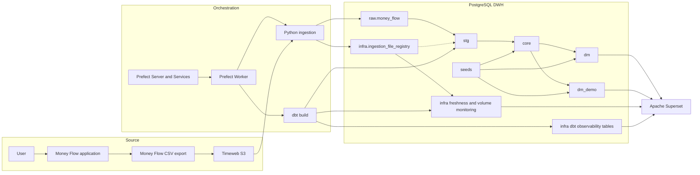

# Finance Analytics Platform: End-to-End Application Logic

## Table of Contents

- [Purpose](#purpose)
- [Scope](#scope)
- [End-to-End Summary](#end-to-end-summary)
- [Architecture Overview](#architecture-overview)
- [System Components](#system-components)
- [Step 1: Financial Data Creation](#step-1-financial-data-creation)
- [Step 2: Money Flow Export and S3 Upload](#step-2-money-flow-export-and-s3-upload)
- [Step 3: Prefect Scheduling](#step-3-prefect-scheduling)
- [Step 4: Flow Execution](#step-4-flow-execution)
- [Step 5: S3 File Discovery](#step-5-s3-file-discovery)
- [Step 6: Ingestion Registry and Idempotency](#step-6-ingestion-registry-and-idempotency)
- [Step 7: CSV Download and Validation](#step-7-csv-download-and-validation)
- [Step 8: Raw Layer Loading](#step-8-raw-layer-loading)
- [Step 9: Ingestion Completion and dbt Trigger](#step-9-ingestion-completion-and-dbt-trigger)
- [Step 10: dbt Build](#step-10-dbt-build)
- [Step 11: Staging Layer](#step-11-staging-layer)
- [Step 12: Core Layer](#step-12-core-layer)
- [Step 13: Analytical Mart](#step-13-analytical-mart)
- [Step 14: Optional Demo Mart](#step-14-optional-demo-mart)
- [Step 15: Data Quality Tests](#step-15-data-quality-tests)
- [Step 16: Observability Models](#step-16-observability-models)
- [Step 17: dbt Execution History](#step-17-dbt-execution-history)
- [Step 18: Superset Consumption](#step-18-superset-consumption)
- [Failure and Retry Logic](#failure-and-retry-logic)
- [Current Implementation Constraints](#current-implementation-constraints)
- [Data State and Ownership](#data-state-and-ownership)
- [Complete Sequence Diagram](#complete-sequence-diagram)
- [Logic Location Map](#logic-location-map)
- [Document Maintenance](#document-maintenance)


## Purpose

This document describes the complete current runtime logic of the Finance Analytics Platform.

It explains how financial data moves from the Money Flow application through S3, Prefect, Python ingestion, PostgreSQL, dbt and Superset.

The document is intended to answer the following questions:

- What happens after a user exports a Money Flow file
- How the platform detects a new file
- How duplicate processing is prevented
- What data is written into each DWH layer
- Which business transformations are applied
- How transfers and opening balances are represented
- How the private and demo analytical marts are built
- Which failures stop the pipeline
- Which failures are retried automatically
- Which metadata tables describe the current platform state


## Scope

This document describes the current implemented behavior of the platform.

It covers:

- Money Flow CSV exports
- Timeweb S3-compatible object storage
- Prefect scheduling and execution
- Python ingestion
- PostgreSQL raw and infra tables
- dbt seeds, models, tests and hooks
- Private and demo analytical marts
- Data quality and operational monitoring
- Superset consumption at the architectural level

The exact Superset dashboard, dataset, chart and filter definitions are not described because the Superset export files are outside the current document scope.

Deployment, backup, firewall, DNS, HTTPS and server recovery procedures are documented separately.


## End-to-End Summary

The current application flow is:

- The user records income, expenses and transfers in the Money Flow application
- The user exports all required operations into a CSV file
- The user uploads the CSV file into the configured Timeweb S3 bucket and prefix
- Prefect creates a scheduled flow run every 300 seconds
- The Prefect Worker executes the Money Flow ingestion flow
- The ingestion code scans the configured S3 prefix and selects the object with the latest `LastModified` value
- The object is checked against `infra.ingestion_file_registry` by S3 bucket and object key
- A file with status `loaded` is skipped
- A new or previously failed file is downloaded and validated
- All source rows are inserted into `raw.money_flow` without business transformations
- The ingestion registry is updated with the final status and loaded row count
- Prefect runs `dbt build` only after ingestion returns `loaded`
- dbt loads reference seeds, builds the transformation layers and executes data tests
- `stg` normalizes the latest successful ingestion batch
- `core` creates the canonical transaction model, adds opening balances and expands transfers
- `dm` creates the private analytical mart
- `dm_demo` optionally creates an anonymized public demo mart
- `infra` models calculate freshness and ingestion volume status
- dbt hooks write model and test execution results into infrastructure history tables
- Superset reads analytical and observability models from PostgreSQL


## Architecture Overview




## System Components


### Money Flow

Money Flow is the source application in which the user records financial operations.

Data enters the platform through a manually exported CSV file.


### Timeweb S3

Timeweb S3 is the external landing zone for Money Flow CSV exports.

The ingestion process uses the configured endpoint, region, bucket and prefix from `infra/deploy/.env`.


### Prefect

Prefect is responsible for:

- Creating scheduled flow runs
- Preventing overlapping flow runs
- Running the ingestion task
- Retrying failed ingestion tasks
- Starting dbt after successful ingestion
- Retrying a failed dbt task
- Recording flow and task execution state

Prefect does not contain the ingestion business logic or SQL transformation logic.


### Python ingestion

The Python ingestion layer is responsible for:

- S3 connection and object discovery
- Source file metadata collection
- Ingestion registry management
- CSV parsing and structural validation
- Source-preserving loading into `raw.money_flow`
- Returning the orchestration result `loaded` or `skipped`


### PostgreSQL

PostgreSQL contains:

- Raw source snapshots
- Ingestion metadata
- dbt seeds
- Staging models
- Canonical core models
- Private analytical marts
- Optional demo analytical marts
- Data quality monitoring models
- dbt model execution history
- dbt test execution history


### dbt

dbt is responsible for all technical normalization, business transformations, enrichment, data quality tests and analytical model creation.


### Superset

Superset is the BI consumption layer.

It reads prepared PostgreSQL models and does not load files from S3 or transform raw CSV data.


## Step 1: Financial Data Creation

The user records financial operations in Money Flow.

The source data may contain:

- Income operations
- Expense operations
- Transfers between accounts
- Account names
- Transaction and transfer amounts
- Currencies
- Parent categories and categories
- Counterparties
- Tags
- Places
- Notes

Opening balances are not taken from the Money Flow CSV in the current DWH logic. They are stored in the private `dim_accounts` seed and added later in the core layer.


## Step 2: Money Flow Export and S3 Upload

The user exports Money Flow data into CSV format and uploads the file into the configured S3 prefix.

The expected source columns are:

- `Number`
- `Date`
- `Account`
- `Amount`
- `Currency`
- `Parent Category`
- `Subcategory`
- `Category`
- `Counterparty`
- `Transfer: Account`
- `Transfer: Amount`
- `Transfer: Currency`
- `Tags`
- `Place`
- `Note`

The file name is not required to follow a specific naming convention in the current code.

Selection is based on the S3 object `LastModified` value rather than on the object name.


## Step 3: Prefect Scheduling

The deployment is defined in the project-level `prefect.yaml` file.

Current deployment settings:

- Deployment name: `money-flow-ingestion`
- Flow entrypoint: `orchestration/flows/money_flow_s3_ingestion_flow.py:money_flow_s3_ingestion_flow`
- Work pool: `finance-process-pool`
- Schedule interval: 300 seconds
- Concurrency limit: 1
- Collision strategy: `CANCEL_NEW`

A scheduled run is created every five minutes.

Only one run of this deployment may execute at a time. If another scheduled run collides with an active run, the new run is cancelled instead of being queued.

This prevents multiple ingestion processes from handling the same source at the same time and prevents a backlog of overlapping scheduled runs.


## Step 4: Flow Execution

The Prefect Worker polls `finance-process-pool` and executes the flow named `money-flow-s3-ingestion-flow`.

The flow contains two tasks:

- `load-money-flow-from-s3`
- `run-dbt-build`

The ingestion task calls:

```
load_money_flow_from_s3()
```

The task returns one of the expected orchestration results:

- `loaded`
- `skipped`

The dbt task handles the result as follows:

- `loaded` starts `dbt build`
- `skipped` ends the flow without running dbt
- Any other result raises an error


## Step 5: S3 File Discovery

The ingestion process loads runtime variables from:

```
infra/deploy/.env
```

The required S3 configuration includes:

- `S3_ENDPOINT_URL`
- `S3_ACCESS_KEY_ID`
- `S3_SECRET_ACCESS_KEY`
- `S3_BUCKET`
- `S3_PREFIX`

The region defaults to `ru-1` when `S3_REGION` is not defined.

The ingestion process creates an S3 client and scans all pages returned by `list_objects_v2` for the configured bucket and prefix.

For every object:

- Keys ending with `/` are ignored as directory-like objects
- The object with the greatest `LastModified` value is retained

If no file is found, ingestion raises an error.

After selecting the latest object, ingestion requests its metadata through `head_object` and reads:

- `ContentLength` as `file_size_bytes`
- `ETag` as `file_checksum`

Quotation marks are removed from the ETag before it is stored.


## Step 6: Ingestion Registry and Idempotency

Every source object is tracked in:

```
infra.ingestion_file_registry
```

The registry contains:

- `ingestion_id`
- `source_system`
- `source_object`
- `raw_table`
- `s3_bucket`
- `s3_key`
- `file_size_bytes`
- `file_checksum`
- `status`
- `rows_loaded`
- `error_message`
- `discovered_at`
- `started_at`
- `finished_at`

The logical source defaults are:

- `source_system = money_flow_app`
- `source_object = money_flow`
- `raw_table = raw.money_flow`

The registry has a unique index on:

```
s3_bucket, s3_key
```


### New file

When the selected bucket and key do not exist in the registry, a new row is created with status:

```
pending
```

The initial insert records the S3 metadata and returns the generated `ingestion_id`.


### Existing loaded file

When the selected bucket and key already exist with status `loaded`, ingestion returns:

```
skipped
```

No raw rows are inserted and dbt is not executed.


### Existing non-loaded file

When the selected bucket and key exist with status `pending`, `processing` or `failed`, ingestion attempts to process the file again.

Before reading the file, the registry row is changed to:

```
processing
```

The update:

- Sets `started_at` to the current time
- Clears `finished_at`
- Clears the previous `error_message`

This status change is committed before the file data is loaded.


## Step 7: CSV Download and Validation

The selected S3 object is downloaded completely into memory and decoded with `CSV_ENCODING`.

Default CSV settings are:

- Encoding: `utf-8`
- Delimiter: `,`
- Quote character: `"`

The file is parsed with `csv.DictReader`.

Validation fails when:

- The file is empty
- The file has no header row
- The file contains only a header row
- The file has no data rows
- Any required source column is missing
- The file cannot be decoded with the configured encoding
- The S3 object cannot be downloaded

Additional source columns are not rejected. They are ignored because only explicitly mapped columns are inserted into the raw table.

The validation checks column presence only. Data types and business values are not validated in the ingestion layer.


## Step 8: Raw Layer Loading

The ingestion layer maps source columns into `raw.money_flow` without business transformations.

Source values are stored as text:

- Dates remain text
- Amounts remain text
- Currencies remain source text
- Categories remain source text
- Tags and notes remain source text

Each inserted row also receives:

- `source_file` containing the complete S3 object key
- `ingestion_id` linking the row to the registry batch
- `raw_id` generated by PostgreSQL
- `ingested_at` generated by PostgreSQL
- `ingested_by` generated from the current database user

The target table is append-only in the current ingestion code. Successful source snapshots are retained in `raw.money_flow` and are not deleted when a newer file is loaded.

The raw insert and final registry update occur in the same database transaction.

After all rows are inserted, the registry row is changed to:

```
loaded
```

The update records:

- `rows_loaded`
- `finished_at`
- A cleared `error_message`

The transaction is then committed.


## Step 9: Ingestion Completion and dbt Trigger

After a successful commit, ingestion returns:

```
loaded
```

Prefect then starts:

```
dbt build \
  --project-dir dbt \
  --profiles-dir /root/.dbt
```

The command runs with:

```
/opt/finance_analytics
```

as its working directory.

When ingestion returns `skipped`, the dbt task logs that no new file was loaded and exits without running dbt.


## Step 10: dbt Build

The dbt project uses the following model configuration:

- `01_stg` is built in schema `stg` as views
- `02_core` is built in schema `core` as tables
- `03_dm` is built in schema `dm` as tables
- `04_dm_demo` is built in schema `dm_demo` as tables when enabled
- `90_infra` is built in schema `infra`
- Seeds are built in schema `seed`

The custom dbt naming convention keeps layer prefixes in dbt node names such as `stg__fact_transaction`, while physical PostgreSQL relations use names such as `stg.fact_transaction`, `core.fact_transaction` and `dm.fact_transaction`.

The optional demo layer is controlled by:

```
DBT_ENABLE_DEMO
```

The default environment example sets:

```
DBT_ENABLE_DEMO=False
```

`dbt build` resolves dependencies through the dbt DAG and executes the required seeds, models and tests.

At the end of the invocation, dbt runs two hooks:

- `log_test_results_to_infra()`
- `log_model_runs_to_infra()`


## Step 11: Staging Layer

The staging model is:

```
stg.fact_transaction
```

It is materialized as a view.


### Latest batch selection

The model identifies the latest successful batch with:

```
MAX(ingestion_id)
```

filtered by:

- `source_system = money_flow_app`
- `source_object = money_flow`
- `raw_table = raw.money_flow`
- `status = loaded`

Only raw rows with that `ingestion_id` are included in the staging model.

This means the analytical pipeline uses the latest successful source snapshot rather than combining all historical raw snapshots.


### Text cleanup

The model:

- Trims leading and trailing whitespace with `BTRIM`
- Converts empty strings into `NULL`
- Converts currency and transfer currency values to upper case
- Preserves the remaining source text values


### Date conversion

`transaction_date` is parsed with the exact pattern:

```
YYYY-MM-DD HH24:MI:SS
```

The result is stored as a PostgreSQL timestamp.

A non-empty value that does not match this format causes the dbt model to fail.


### Amount conversion

`amount` and `transfer_amount` are converted to `NUMERIC(18, 2)`.

Before conversion, the model:

- Removes spaces
- Replaces a comma decimal separator with a dot

A non-empty value that cannot be converted to numeric causes the dbt model to fail.


### Technical helper fields

The model derives `flow_type` from the sign of `amount`:

- Negative amount becomes `expense`
- Positive amount becomes `income`
- Zero or `NULL` amount becomes `zero`

The model derives `is_transfer` as true when at least one of the following is present:

- `transfer_account`
- `transfer_amount`

No account mapping, category mapping, opening balance logic or analytical classification is applied in `stg`.


## Step 12: Core Layer

The canonical model is:

```
core.fact_transaction
```

It is materialized as a table and serves as the source of truth for downstream analytical marts.


### Source transactions

All rows from `stg__fact_transaction` are read into the canonical structure.

A staging row with `is_transfer = true` receives the preliminary transfer type:

```
transfer_out
```

### Opening balances

The private `dim_accounts` seed contains:

- Account identifier
- Account name
- Opening date
- Initial amount
- Currency
- Active account flag
- Reserve account flag
- Credit account flag

One opening balance row is generated for every account in `dim_accounts`.

Opening balance rows use:

- `transaction_ts = opening_date`
- `account = account_name`
- `amount = initial_amount`
- `currency = currency`
- `flow_type = opening_balance`
- `note = Opening balance loaded from seed`
- `source_file = seed.dim_accounts`
- `ingestion_id = NULL`

Source transactions and opening balances are combined with `UNION ALL`.


### Transfer expansion

The original Money Flow transfer row represents the outgoing side of a transfer.

The core model creates an additional incoming row only when both values are present:

- `transfer_account`
- `transfer_amount`

The generated incoming row:

- Uses the original `transfer_account` as its account
- Uses the original `transfer_amount` as its amount
- Uses `transfer_currency` or falls back to the original currency
- Stores the original account as the related transfer account
- Stores the original amount as the related transfer amount
- Receives `transfer_type = transfer_in`

The original row remains in the model with `transfer_type = transfer_out`.

A source row marked as a transfer but missing either transfer account or transfer amount remains a `transfer_out` record and does not produce a `transfer_in` record.


### Transaction identifier

Every canonical row receives an MD5 transaction identifier built from canonical source attributes.

The hash includes:

- Source number
- Transaction timestamp
- Account
- Amount
- Currency
- Categories
- Counterparty
- Transfer fields
- Tags
- Place
- Note
- Transfer type
- Source file

The identifier does not use `raw_id` or `ingestion_id`.


### Transaction amount fields

The original signed amount is preserved in `amount`.

`amount_abs` is calculated as follows:

- Expense becomes the absolute amount
- Income keeps its amount
- Opening balance keeps its seeded signed amount
- Other and transfer records use the absolute amount

Because opening balances keep their sign, a negative opening balance may also remain negative in `amount_abs` under the current implementation.


### Canonical transaction type

The final type priority is:

- `transfer_out`
- `transfer_in`
- `expense`
- `income`
- `opening_balance`
- `other`

Transfer type has priority over source flow type.


### Account enrichment

The canonical row is enriched by joining `dim_accounts` on exact account name.

The model adds:

- `is_active_account`
- `is_reserve_account`
- `is_credit_account`

The join is a left join. A missing account mapping produces `NULL` account flags in the model and is detected later by an error-level dbt test.


## Step 13: Analytical Mart

The private analytical mart is:

```
dm.fact_transaction
```

It is materialized as a table.


### Active account filter

Only canonical rows with:

```
is_active_account = true
```

are included.

Transactions and opening balances for inactive or unmapped accounts are excluded from the analytical mart.


### Regular and reserve expense tags

The mart joins two seed dictionaries:

- `regular_expense_tag`
- `reserve_expense_tag`

The source tags string is split with the exact delimiter `,`

Only active seed rows participate in the join.

The model creates:

- `is_regular_expense`
- `is_reserve_expense`


### Expense type

The public analytical value `expense_type` is derived with the following priority:

- A regular tag produces `Regular`
- Otherwise a reserve tag produces `Reserve`
- Otherwise the row produces `Discretionary`

When a transaction contains both an active regular tag and an active reserve tag, `Regular` has priority.

The field is calculated for every row, including income, transfers and opening balances.
Downstream charts should combine it with `transaction_type` when expense-only analysis is required.


### Account type

The analytical account type is derived with the following priority:

- Reserve account produces `Reserve`
- Otherwise credit account produces `Credit`
- Otherwise the account produces `Regular`

When both reserve and credit flags are true, `Reserve` has priority.


### Output transaction type

Canonical values are converted into display values:

- `transfer_out` becomes `Transfer out`
- `transfer_in` becomes `Transfer in`
- `expense` becomes `Expense`
- `income` becomes `Income`
- `opening_balance` becomes `Opening balance`

The mart exposes only the fields required by the analytical layer and does not retain all raw and ingestion metadata.


## Step 14: Optional Demo Mart

The optional anonymized mart is:

```
dm_demo.fact_transaction_demo
```

It is created only when:

```
DBT_ENABLE_DEMO=True
```

The demo mart starts from the same canonical transactions as the private mart and applies the same active account filter and expense classification logic.


### Account anonymization

A real account is first resolved in the private `dim_accounts` seed.

The real `account_id` is then joined to the same identifier in `dim_accounts_demo`.

The demo account name replaces the real account name.

This design preserves account-level analytical structure while removing the real account label.


### Category anonymization

The private `category_mapping_demo` seed maps:

- Real parent category
- Real category
- Demo parent category
- Demo category
- Amount masking factor

The mapping uses the exact pair:

```
real_parent_category, real_category
```


### Amount masking

The demo amount is calculated as:

```
real amount * amount_factor
```

The result is rounded to two decimal places.

When no category mapping is found, the SQL expression uses an amount factor of `1.0`.
**Separate demo tests are intended to detect missing category mappings before the demo result is accepted.**


### Sensitive text removal

The demo mart removes:

- Tags
- Notes

Both fields are returned as `NULL`.

The demo mart preserves:

- Transaction timestamp
- Transaction structure
- Transaction type
- Expense classification
- Account classification


## Step 15: Data Quality Tests

`dbt build` executes schema tests, seed tests and singular tests.


### Test severity by layer

The project-level defaults are:

- Staging tests use severity `warn`
- Core tests use severity `error`
- Private mart tests use severity `warn`
- Demo mart schema tests use severity `warn`
- Infrastructure model tests use severity `warn`
- Singular tests in the demo test directory use severity `error`

A warning test is recorded but does not fail the dbt command.

An error test causes `dbt build` to fail.


### Staging tests

The staging model checks include:

- `raw_id` is not null and unique
- Transaction date is not null
- Ingestion metadata is not null
- Flow type is one of `income`, `expense` or `zero`
- Transfer flag is not null


### Core tests

The core model checks include:

- Transaction identifier is not null and unique
- Transaction timestamp is not null
- Account is not null
- Absolute amount is not null
- Transaction type is accepted
- Ingestion metadata fields required for canonical rows are populated


### Account dictionary coverage

The singular test `assert_core_accounts_exist_in_dim_accounts` returns every distinct canonical account that is missing from `dim_accounts`.

It has explicit severity `error`.

This prevents unmanaged accounts from being silently accepted by downstream analytics.


### Expense tag dictionary tests

The `regular_expense_tag` and `reserve_expense_tag` seeds are checked for:

- Non-null and unique tag values
- No more than one active row
- Active tag values matching tags present in raw.money_flow

The generic test `active_seed_tags_exist_in_raw_tags` detects misspelled or outdated active tag names and uses severity warn.

The singular tests enforce at most one active row but do not require an active row to exist.


### Demo mapping tests

When demo mode is enabled, error-level singular tests verify:

- Required real category fields are indicated
- Required demo category fields are indicated
- Amount factors are indicated
- A real category pair has no more than one mapping
- Every category pair used in the canonical transaction model exists in the demo mapping

The demo model also checks accepted transaction, expense and account display values.


## Step 16: Observability Models


### Data freshness

The model is:

```
infra.data_quality_freshness
```

It is explicitly materialized as a view.

The model selects the most recent registry row with status `loaded`, ordered by `finished_at`.

It calculates the number of seconds since the latest successful ingestion and assigns:

- `fresh` when the latest load is **no more than 3 days** old
- `warning` when the latest load is **more than 3 days and no more than 7 days** old
- `stale` when the latest load is ** more than 7 days** old
- `no_data` when no successful ingestion exists

The view also returns a human-readable duration in days, hours and minutes.

Because it is a view and uses `NOW()`, the freshness state is recalculated when queried.


### Data volume monitoring

The model is:

```
infra.data_volume_monitoring
```

The latest successful ingestion is compared with up to seven previous successful ingestions.

The baseline uses load ranks 2 through 8 and calculates:

- Number of baseline loads
- Average rows loaded
- Minimum rows loaded
- Maximum rows loaded
- Percentage deviation of the latest load from the average

The resulting status is:

- `no_baseline` when no historical baseline exists
- `weak_baseline` when fewer than three historical loads exist
- `invalid_baseline` when the average baseline volume is zero
- `anomaly` when the latest volume is no more than 20 percent of the average
- `warning` when the latest volume is no more than 60 percent of the average
- `warning` when the latest volume is at least 250 percent of the average
- `normal` otherwise

The model monitors snapshot row counts rather than incremental row changes because every ingestion loads a complete Money Flow export.


## Step 17: dbt Execution History

The `on-run-end` hooks store dbt execution results in the `infra` schema.


### Model run history

The macro creates and writes to:

```
infra.dbt_model_runs_history
```

Each model result stores:

- dbt target
- Invocation identifier
- dbt unique node identifier
- Model name
- Schema name
- Materialization
- Status
- Execution time
- Rows affected when reported by the adapter
- Generation timestamp

The primary key prevents the same model result from being inserted twice for the same target and invocation.


### Test result history

The macro creates and writes to:

```
infra.dbt_test_results_history
```

The history table stores every recorded test result by target, invocation and test node.


### Current test state

The macro also maintains:

```
infra.dbt_test_results_current
```

At the end of each invocation, current rows for the active dbt target are deleted and replaced with the test results from the new invocation.

This produces two different views of test execution:

- History across all invocations
- Current state for the latest recorded invocation of each target

Stored test metadata includes:

- Test name
- Related model identifier when available
- Status
- Severity
- Failure count
- Execution time
- Message
- Update timestamp


## Step 18: Superset Consumption

Superset connects to the analytical PostgreSQL database through read-only BI roles.

The intended access separation is:

- `bi_user` for private analytical data
- `bi_demo_user` for public demo analytical data

The private dashboards consume models from:

- `dm`
- `infra`

The public demo dashboard consumes the anonymized model from:

- `dm_demo`
- `infra`

The current project overview identifies the following dashboard areas:

- Expense analytics
- Income analytics
- Balance tracking
- Data Quality and Observability

Superset does not trigger ingestion and does not execute dbt transformations. It queries the latest materialized DWH state.

Transaction charts are based on dates present in transaction data. The current models do not generate a calendar spine, so days without operations are absent rather than represented as explicit zero-value rows.


## Failure and Retry Logic

### Ingestion task failure

The Prefect ingestion task is configured with:

- Two retries
- A 60-second delay between retries

This means one initial attempt may be followed by up to two retry attempts.

When an exception occurs after the registry record has been identified:

- The current raw load transaction is rolled back
- A separate database connection attempts to change the registry status to `failed`
- The error message is truncated to 4000 characters
- `finished_at` is recorded
- The exception is raised back to Prefect

A retry finds the existing registry row and processes it again because its status is not `loaded`.


### Registry update failure during error handling

If ingestion fails and the separate attempt to mark the registry row as `failed` also fails:

- The original exception is preserved
- The registry update exception is printed
- The task still fails

The registry may remain in `processing` until a later retry or manual correction.


### dbt task failure

The Prefect dbt task is configured with:

- One retry
- A 60-second delay before the retry

This means one initial dbt attempt may be followed by one retry attempt.

`subprocess.run(..., check=True)` raises an exception when `dbt build` returns a non-zero exit code.

Possible causes include:

- SQL compilation errors
- SQL execution errors
- Invalid date or amount conversion
- Missing required seeds
- Error-level dbt test failures
- Database connectivity problems
- Permission problems


### Warning-level dbt tests

Warning-level test failures are logged by dbt but do not cause the command to fail.

The flow may therefore complete successfully while warning-level data quality findings remain visible in the dbt test result tables.


### No file in S3

When no object exists under the configured prefix, ingestion raises an error.

The Prefect ingestion retry policy is applied.


### Invalid CSV

An empty file, header-only file or file missing required columns causes ingestion to fail before raw rows are committed.

The registry is marked `failed` when possible and Prefect retries the task.


### Already loaded file

A loaded file is not treated as an error.

Ingestion returns `skipped`, the dbt task exits normally and the flow completes without rebuilding models.


## Current Implementation Constraints

The following behavior is intentional or follows directly from the current implementation and should be understood before changing the pipeline.


### Only the latest S3 object is considered

Every scheduled run selects one object with the greatest `LastModified` value.

The pipeline does not search for all unprocessed objects.

**If multiple new files are uploaded before the next run, only the newest object is selected. After it is marked `loaded`, later runs continue selecting and skipping the same newest object, so older unprocessed objects are not automatically loaded.**


### Idempotency uses bucket and key only

A registry record is identified by:

```
s3_bucket, s3_key
```

The stored ETag is metadata and is not used in the duplicate check.

If a file is replaced in S3 under the same key after that key has status `loaded`, the new content is skipped under the current logic.

A new export should therefore use a new S3 object key.


### dbt is not automatically retriggered after final failure

Ingestion status changes to `loaded` before dbt starts.

If dbt fails after its Prefect retry is exhausted, the next scheduled run finds the same latest file with status `loaded` and returns `skipped`.

Because `skipped` prevents dbt execution, later schedule cycles do not automatically retry the failed dbt build.

Recovery currently requires one of the following:

- Run `dbt build` manually after correcting the problem
- Upload a new source object with a new key
- Manually change the ingestion state only when the operational consequences are understood


### Analytics use one source snapshot

Raw data retains multiple ingestion batches, but `stg__fact_transaction` selects only the greatest successful `ingestion_id`.

The analytical result represents the latest complete Money Flow export plus opening balances from seeds.

It does not union all historical exports.


### Source changes can replace historical analytical state

Because the latest CSV is treated as a complete snapshot, removing or changing an old transaction in a new Money Flow export also removes or changes that transaction in the next analytical build.

The previous raw snapshot remains available for technical history, but downstream models no longer use it.


### File data is loaded into memory

The complete S3 object and parsed row collection are held in memory during ingestion.

This is suitable for the current personal finance file size but is not a streaming implementation.


### Exact source formatting is expected

The current transformations assume:

- Exact required CSV column names
- Configured CSV delimiter and quote character
- Transaction dates formatted as `YYYY-MM-DD HH24:MI:SS`
- Numeric values convertible after removing spaces and replacing comma with dot
- Tags separated by comma and space for analytical tag classification


### Account mapping uses exact names

The join from transactions to `dim_accounts` uses exact account name equality.

Whitespace is trimmed in staging, but case and other naming differences are not normalized.

A renamed or unmapped account causes an error-level dictionary coverage test.


### Demo mapping uses exact categories

The demo category join uses exact parent category and category values.

Missing mappings may result in null demo categories and an unmasked factor fallback of `1.0`, while error-level demo tests are expected to expose the missing mapping.


### Opening balance `amount_abs` can retain a negative sign

The current core SQL preserves the original sign of opening balances in both `amount` and `amount_abs`.

This differs from the usual semantic expectation of an absolute-value field and should be considered in balance visualizations.


## Data State and Ownership

### Source state

- Money Flow is the user-managed source system
- S3 contains uploaded source exports
- The source file is not modified by the platform


### Ingestion state

- `infra.ingestion_file_registry` is the source of truth for file processing state
- `raw.money_flow` contains source-preserving rows from successful ingestion snapshots


### Transformation state

- `stg` represents the latest successful source snapshot after technical normalization
- `core` represents canonical financial operations and account enrichment
- `dm` represents private BI-ready analytics
- `dm_demo` represents optional anonymized public analytics


### Reference state

- `dim_accounts` defines account metadata and opening balances
- `regular_expense_tag` defines the active regular expense tag
- `reserve_expense_tag` defines the active reserve expense tag
- `dim_accounts_demo` defines public demo account labels and balances
- `category_mapping_demo` defines private real-to-demo category mapping and masking factors


### Operational state

- Prefect stores flow and task execution metadata in its separate PostgreSQL database
- `infra.dbt_model_runs_history` stores dbt model execution history
- `infra.dbt_test_results_history` stores historical dbt test outcomes
- `infra.dbt_test_results_current` stores the latest test state by target
- `infra__data_quality_freshness` calculates current ingestion freshness
- `infra__data_volume_monitoring` evaluates the latest snapshot row count against historical loads


## Logic Location Map

### Orchestration

```
prefect.yaml
orchestration/flows/money_flow_s3_ingestion_flow.py
```

Contains:

- Schedule
- Concurrency policy
- Work pool
- Task retry policy
- Ingestion result handling
- dbt command execution


### Ingestion

```
ingestion/load_money_flow_from_s3.py
```

Contains:

- Environment loading
- S3 discovery
- CSV parsing
- Required column validation
- Registry status changes
- Raw inserts
- Error handling


### PostgreSQL bootstrap

```
infra/bootstrap/001_roles.sql
infra/bootstrap/002_role_passwords.sh
infra/bootstrap/003_db_settings.sql
infra/bootstrap/004_extensions.sql
infra/bootstrap/005_schemas.sql
infra/bootstrap/006_grants.sql
infra/bootstrap/010_raw_tables.sql
infra/bootstrap/011_raw_comments.sql
infra/bootstrap/012_infra_tables.sql
infra/bootstrap/013_infra_comments.sql
```

Contains:

- Database roles and role passwords
- Database-level settings
- PostgreSQL extensions
- DWH schemas
- Role grants and privileges
- Raw.money_flow
- Infra.ingestion_file_registry
- Infrastructure and observability tables
- Comments for raw and infrastructure database objects


### dbt project configuration

```
dbt/dbt_project.yml
```

Contains:

- Layer schemas
- Materializations
- Demo enablement
- Test severities
- End-of-run hooks


### Staging logic

```
dbt/models/01_stg/stg__fact_transaction.sql
```

Contains:

- Latest batch selection
- Text cleanup
- Date and amount parsing
- Flow type
- Transfer flag


### Core logic

```
dbt/models/02_core/core__fact_transaction.sql
```

Contains:

- Opening balances
- Transfer expansion
- Canonical transaction types
- Stable transaction identifier
- Account enrichment


### Private analytical logic

```
dbt/models/03_dm/dm__fact_transaction.sql
```

Contains:

- Active account filtering
- Regular and reserve classification
- Display transaction types
- Account types


### Demo analytical logic

```
dbt/models/04_dm_demo/dm_demo__fact_transaction_demo.sql
```

Contains:

- Demo account mapping
- Demo category mapping
- Amount masking
- Removal of tags and notes


### Observability logic

```
dbt/models/90_infra/infra__data_quality_freshness.sql
dbt/models/90_infra/infra__data_volume_monitoring.sql
dbt/macros/macro__log_model_runs_to_infra.sql
dbt/macros/macro__log_test_results_to_infra.sql
```

Contains:

- Freshness thresholds
- Volume anomaly thresholds
- Model execution history
- Historical and current test state


### Data quality logic

```
dbt model YAML files
dbt/seeds/seeds.yml
dbt/tests/
```

Contains:

- Column tests
- Accepted values
- Dictionary coverage tests
- Tag configuration tests
- Demo mapping tests


## Document Maintenance

This document should be updated whenever any of the following changes:

- S3 object selection logic
- Ingestion registry identity or statuses
- CSV source column contract
- Prefect schedule, concurrency or retry settings
- Raw table structure
- Latest ingestion batch selection logic
- Transfer representation
- Opening balance source
- Account or category dictionaries
- Expense classification rules
- Demo anonymization rules
- Data quality severity
- Freshness or volume thresholds
- dbt history table logic
- Superset consumption schemas

The implementation files remain the technical source of truth. This document is the readable end-to-end explanation of their combined behavior.
