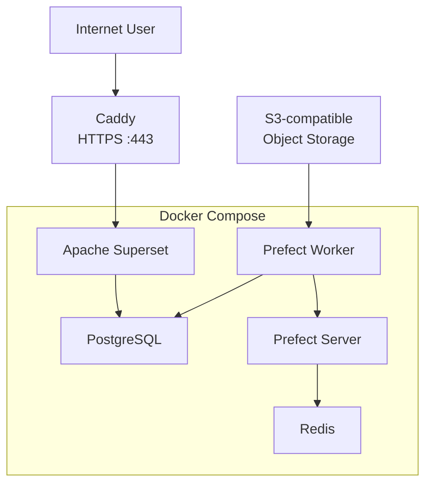

# VPS Deployment Guide

## Table of Contents

- [VPS Deployment Guide](#vps-deployment-guide)
  - [Table of Contents](#table-of-contents)
  - [1. Overview](#1-overview)
    - [1.1 Intended Audience](#11-intended-audience)
    - [1.2 Prerequisites](#12-prerequisites)
      - [Ubuntu VPS](#ubuntu-vps)
      - [GitHub Repository Access](#github-repository-access)
      - [SSH Key for GitHub](#ssh-key-for-github)
      - [Runtime Secrets](#runtime-secrets)
      - [Private dbt Seeds](#private-dbt-seeds)
      - [Domain Name](#domain-name)
    - [1.3 Security Principles](#13-security-principles)
    - [1.4 Deployment Method](#14-deployment-method)
  - [2. Deployment Architecture](#2-deployment-architecture)
  - [3. Server Preparation](#3-server-preparation)
    - [3.1 Check the Ubuntu Version](#31-check-the-ubuntu-version)
    - [3.2 Check Available Resources](#32-check-available-resources)
    - [3.3 Update the Package Index](#33-update-the-package-index)
    - [3.4 Install Available Updates](#34-install-available-updates)
    - [3.5 Check Whether a Reboot Is Required](#35-check-whether-a-reboot-is-required)
    - [3.6 Check the System Time](#36-check-the-system-time)
    - [3.7 Final Check](#37-final-check)
  - [4. Installing Docker](#4-installing-docker)
    - [4.1 Remove Conflicting Packages](#41-remove-conflicting-packages)
    - [4.2 Install Repository Requirements](#42-install-repository-requirements)
    - [4.3 Add the Docker Signing Key](#43-add-the-docker-signing-key)
    - [4.4 Add the Official Docker Repository](#44-add-the-official-docker-repository)
    - [4.5 Install Docker Engine and Docker Compose](#45-install-docker-engine-and-docker-compose)
    - [4.6 Check the Docker Service](#46-check-the-docker-service)
    - [4.7 Allow the Current User to Run Docker](#47-allow-the-current-user-to-run-docker)
    - [4.8 Verify the Installation](#48-verify-the-installation)
    - [4.9 Final Check](#49-final-check)
  - [5. Preparing the Project](#5-preparing-the-project)
    - [5.1 Install Git](#51-install-git)
    - [5.2 Create the Project Directory](#52-create-the-project-directory)
    - [5.3 Create a Dedicated GitHub SSH Key](#53-create-a-dedicated-github-ssh-key)
    - [5.4 Add the Public Key to GitHub](#54-add-the-public-key-to-github)
    - [5.5 Configure SSH for GitHub](#55-configure-ssh-for-github)
    - [5.6 Test GitHub Access](#56-test-github-access)
    - [5.7 Clone the Repository](#57-clone-the-repository)
    - [5.8 Verify the Repository (skip if u are cloning public repo)](#58-verify-the-repository-skip-if-u-are-cloning-public-repo)
    - [5.9 Verify the Project Structure](#59-verify-the-project-structure)
    - [5.10 Updating the Repository Later](#510-updating-the-repository-later)
    - [5.11 Final Check](#511-final-check)
  - [6. Runtime Configuration](#6-runtime-configuration)
    - [6.1 Move to the Project Directory](#61-move-to-the-project-directory)
    - [6.2 Create the Environment File](#62-create-the-environment-file)
    - [6.3 Configure Environment Variables](#63-configure-environment-variables)
    - [6.4 Check for Unchanged Placeholders](#64-check-for-unchanged-placeholders)
    - [6.5 Create the Required Private dbt Seed](#65-create-the-required-private-dbt-seed)
    - [6.6 Prepare the Optional Demo Environment](#66-prepare-the-optional-demo-environment)
    - [6.7 Verify the Required Files](#67-verify-the-required-files)
    - [6.8 Verify Git Protection](#68-verify-git-protection)
    - [6.9 Validate the Docker Compose Configuration](#69-validate-the-docker-compose-configuration)
    - [6.10 Final Check](#610-final-check)
  - [7. Starting the Platform](#7-starting-the-platform)
    - [7.1 Start the Docker Compose Stack](#71-start-the-docker-compose-stack)
    - [7.2 Check Container Status](#72-check-container-status)
    - [7.3 Review Startup Logs](#73-review-startup-logs)
    - [7.4 Verify Docker Resource Creation](#74-verify-docker-resource-creation)
    - [7.5 Final Check](#75-final-check)
  - [8. Deploying Prefect](#8-deploying-prefect)
    - [8.1 Check the Prefect Services](#81-check-the-prefect-services)
    - [8.2 Check the Work Pool](#82-check-the-work-pool)
    - [8.3 Check Existing Deployments](#83-check-existing-deployments)
    - [8.4 Create the Deployment](#84-create-the-deployment)
    - [8.5 Verify the Deployment](#85-verify-the-deployment)
      - [Access the Prefect UI Through an SSH Tunnel](#access-the-prefect-ui-through-an-ssh-tunnel)
    - [8.6 Final Check](#86-final-check)
  - [9. Building the Warehouse](#9-building-the-warehouse)
    - [9.1 Verify the dbt Project](#91-verify-the-dbt-project)
    - [9.2 Install dbt Dependencies](#92-install-dbt-dependencies)
    - [9.3 Build the Warehouse](#93-build-the-warehouse)
    - [9.4 Review the Build Result](#94-review-the-build-result)
    - [9.5 Verify the Created Schemas](#95-verify-the-created-schemas)
    - [9.6 Final Check](#96-final-check)
  - [10. Initializing an Empty Environment](#10-initializing-an-empty-environment)
    - [10.1 Check the Created Tables](#101-check-the-created-tables)
    - [10.2 Check Table Row Counts](#102-check-table-row-counts)
    - [10.3 Verify Database Roles](#103-verify-database-roles)
    - [10.4 Verify the Fresh Superset Instance](#104-verify-the-fresh-superset-instance)
    - [10.5 Final Check](#105-final-check)
  - [11. Publishing the Platform](#11-publishing-the-platform)
    - [11.1 Prepare the Domain](#111-prepare-the-domain)
    - [11.2 Verify the Superset Port](#112-verify-the-superset-port)
    - [11.3 Configure the Firewall](#113-configure-the-firewall)
    - [11.4 Check Ports 80 and 443](#114-check-ports-80-and-443)
    - [11.5 Install Caddy](#115-install-caddy)
    - [11.6 Configure the Reverse Proxy](#116-configure-the-reverse-proxy)
    - [11.7 Validate and Apply the Caddy Configuration](#117-validate-and-apply-the-caddy-configuration)
    - [11.8 Verify HTTPS](#118-verify-https)
    - [11.9 Keep Prefect Private](#119-keep-prefect-private)
    - [11.10 Final Check](#1110-final-check)
  - [12. Final Validation](#12-final-validation)
    - [12.1 Check the Docker Services](#121-check-the-docker-services)
    - [12.2 Check Superset Locally](#122-check-superset-locally)
    - [12.3 Check Superset Through HTTPS](#123-check-superset-through-https)
    - [12.4 Check Public Port Exposure](#124-check-public-port-exposure)
    - [12.5 Check Prefect](#125-check-prefect)
    - [12.6 Check dbt](#126-check-dbt)
    - [12.7 Check the Database](#127-check-the-database)
    - [12.8 Import the Superset Dashboards](#128-import-the-superset-dashboards)
    - [12.9 Check the Superset Interface](#129-check-the-superset-interface)
    - [12.10 Check Caddy](#1210-check-caddy)
    - [12.11 Final Check](#1211-final-check)
  - [13. Backup Strategy](#13-backup-strategy)
    - [13.1 Data That Must Be Backed Up](#131-data-that-must-be-backed-up)
    - [13.2 Create the Backup Directory](#132-create-the-backup-directory)
    - [13.3 Back Up the Analytical Database](#133-back-up-the-analytical-database)
    - [13.4 Back Up Superset Metadata](#134-back-up-superset-metadata)
    - [13.5 Back Up Prefect Metadata](#135-back-up-prefect-metadata)
    - [13.6 Back Up Runtime Configuration](#136-back-up-runtime-configuration)
    - [13.7 Create Backup Checksums](#137-create-backup-checksums)
    - [13.8 Copy the Backup Outside the VPS](#138-copy-the-backup-outside-the-vps)
    - [13.9 Protect the S3 Source Data](#139-protect-the-s3-source-data)
    - [13.10 Recommended Backup Frequency](#1310-recommended-backup-frequency)
    - [13.11 Final Check](#1311-final-check)


## 1. Overview

This guide describes how to deploy the Finance Analytics Platform from scratch on a clean Ubuntu VPS.

It covers the complete server deployment process, including:

- preparing the Ubuntu operating system
- installing Docker Engine and Docker Compose
- configuring secure access to GitHub
- cloning the project into the server filesystem
- creating runtime environment files and private dbt seeds
- building and starting the Docker Compose environment
- deploying the Prefect flow
- building and testing the dbt project
- configuring a domain, firewall, Caddy reverse proxy and HTTPS
- validating the complete production environment
- creating backups

After completing this guide, the server will run the following containerized services:

- PostgreSQL 16 as the analytical database and layered data warehouse
- Apache Superset as the BI and dashboard interface
- Prefect Server as the orchestration API and web interface
- Prefect Worker for scheduled ingestion and dbt execution
- Prefect PostgreSQL as the orchestration metadata database
- Redis as the Prefect messaging broker and cache

Superset will be published through Caddy over HTTPS.

PostgreSQL, Prefect and Superset will not be exposed directly to the public Internet. Public access will be provided only through the reverse proxy where required.


### 1.1 Intended Audience

This guide is intended for a person who has basic experience with:

- using a command-line interface
- connecting to a remote server through SSH
- working with Git repositories
- editing text configuration files
- understanding the basic purpose of Docker containers

Advanced Linux administration experience is not required.

Each command is explained in detail, including:

- what the command does
- why it is required
- what each argument and option means
- what changes it makes to the system
- what output should be expected
- what risks or side effects should be considered


### 1.2 Prerequisites

Before starting the deployment, the following resources are required.


#### Ubuntu VPS

A virtual private server with a supported Ubuntu Server release is required.

The server must provide:

- SSH access
- administrative privileges through `root` or `sudo`
- a public IPv4 or\and IPv6 address
- enough CPU, memory and disk space for the Docker Compose services


Minimum recommended resources:

- **CPU:** 2 vCPUs
- **Memory:** 4 GB RAM
- **Storage:** 40 GB SSD


Recommended resources:

- **CPU:** 4 vCPUs
- **Memory:** 8 GB RAM
- **Storage:** 80 GB SSD

The exact Ubuntu version and available server resources will be checked before installation begins.


#### GitHub Repository Access

The server must be able to clone the Finance Analytics repository from GitHub.

The deployment uses an SSH connection to GitHub rather than authentication through a password.

The repository is expected to be cloned into:

```
/opt/finance_analytics
```


#### SSH Key for GitHub

A dedicated SSH key must be available on the VPS for repository access.

The private key remains on the server.

Only the public key is added to GitHub.

Private SSH keys, passwords, environment variables and other credentials must never be committed to the repository.


#### Runtime Secrets

The deployment requires credentials and configuration values for:

- PostgreSQL
- Superset
- Prefect
- S3-compatible object storage
- project database roles

These values are stored in:

```
infra/deploy/.env
```

**The `.env` file is excluded from version control and must not be committed.**


#### Private dbt Seeds

The standard project deployment requires a private account seed:

```
dbt/seeds/private/dim_accounts.csv
```

The optional public demo environment also requires:

```
dbt/seeds/private/category_mapping_demo.csv
```

These files contain user-specific mappings and are excluded from version control.

Public `.example` files are included in the repository and document the required structure.

The standard deployment requires `dim_accounts.csv`.

The demo environment is disabled by default through
`DBT_ENABLE_DEMO=False`.

`category_mapping_demo.csv` is required only when the environment is configured
with `DBT_ENABLE_DEMO=True`.


#### Domain Name

A domain name is not required for the initial Docker deployment.

The platform can first be started and tested directly on the VPS through local server interfaces and SSH port forwarding.

A domain becomes necessary when Superset is published on the Internet through Caddy with HTTPS.

The domain must eventually point to the public IP address of the VPS through DNS records.


### 1.3 Security Principles

This guide follows the following deployment principles:

- application credentials are stored outside Git
- PostgreSQL is not exposed directly to the Internet
- Superset remains bound to the server loopback interface
- external web traffic is handled through Caddy
- HTTPS certificates are issued and renewed automatically
- only required firewall ports are opened
- GitHub access uses an SSH key instead of a password
- persistent application data is stored in Docker volumes
- backups are created before destructive operations

Commands and configuration examples use placeholders for passwords, IP addresses and domains.

Real secrets must not be added to the documentation or committed to the repository.


### 1.4 Deployment Method

The deployment is performed incrementally.

Each section of this guide should be completed and verified before moving to the next section.

The recommended process is:

1. Read the complete section.
2. Execute its commands on the VPS.
3. Compare the actual output with the expected result.
4. Resolve any differences or errors.
5. Continue only after the current stage is working correctly.

This approach ensures that the documentation reflects the real deployment process rather than an untested theoretical configuration.


## 2. Deployment Architecture

The production deployment uses a single Ubuntu VPS.

Public HTTPS requests are accepted by Caddy and forwarded to Apache Superset running inside Docker.

The remaining platform services communicate through the internal Docker network and are not exposed directly to the Internet.



The deployment has two main layers:

- Caddy runs on the VPS and handles external HTTPS traffic
- Docker Compose manages the application containers

Caddy performs the following tasks:

- accepts requests on HTTPS port 443
- obtains and renews TLS certificates
- forwards requests to Superset
- hides the internal Superset port from the public Internet

Docker Compose manages the following services:

- PostgreSQL for analytical data and platform metadata
- Apache Superset for dashboards and data visualization
- Prefect Server for orchestration
- Redis for Prefect messaging and caching
- Prefect Worker for executing ingestion and dbt jobs

**Only Caddy should accept public web traffic.**

PostgreSQL, Redis and the internal Prefect services should remain available only inside the VPS and Docker network.


## 3. Server Preparation

This section prepares the Ubuntu VPS for Docker installation and project deployment.

The required checks are:

- Ubuntu version
- available system resources
- package updates
- reboot status
- timezone and clock synchronization


### 3.1 Check the Ubuntu Version

Run:

```
cat /etc/os-release
```

The command prints information about the installed operating system.

- `cat` displays the contents of a file
- `/etc/os-release` contains the operating system name and version

Check the following fields:

```
PRETTY_NAME
VERSION_ID
ID
```

The expected operating system is Ubuntu Server.

An Ubuntu LTS release is recommended because it receives long-term security updates.


### 3.2 Check Available Resources

Check the number of available CPU cores:

```
nproc
```

Check memory usage:

```
free -h
```

The most useful value is `available`, which shows how much memory can still be used by applications.

Check free disk space:

```
df -h /
```

The root filesystem will store:

- Docker images
- Docker volumes
- PostgreSQL data
- application logs
- database backups
- the project repository

The server must have enough free space for both the initial deployment and future data growth.


### 3.3 Update the Package Index

Run:

```
sudo apt update
```

A successful command should finish without repository or signature errors.


### 3.4 Install Available Updates

First review the available updates:

```
apt list --upgradable
```

Then install them:

```
sudo apt upgrade
```

The correct order is:

```
apt update
apt upgrade
```

`apt update` refreshes package information.

`apt upgrade` installs newer versions of already installed packages.

Ubuntu may ask for confirmation:

```
Do you want to continue? [Y/n]
```

Enter:

```text
Y
```

The upgrade may update:

- security libraries
- OpenSSH
- system services
- certificate packages
- Linux kernel packages

Some services may restart automatically.

Do not close the terminal while the upgrade is running.


### 3.5 Check Whether a Reboot Is Required

Run:

```
test -f /var/run/reboot-required && cat /var/run/reboot-required || echo "Reboot is not required"
```

The command checks whether Ubuntu created the reboot-required file after installing updates.

Possible output:

```
*** System restart required ***
```

or:

```
Reboot is not required
```

If a reboot is required, run:

```
sudo reboot
```

The SSH connection will close while the server restarts.

Reconnect to the VPS after it becomes available again.


### 3.6 Check the System Time

Run:

```
timedatectl
```

The command displays:

- current server time
- configured timezone
- clock synchronization status
- NTP service status

Correct time is important for:

- HTTPS certificates
- Docker registry connections
- GitHub SSH connections
- Prefect schedules
- PostgreSQL timestamps
- application logs
- backup timestamps

The recommended server timezone is UTC.

If server timezone is not UTC, set it with:

```
sudo timedatectl set-timezone UTC
```

Enable automatic time synchronization:

```
sudo timedatectl set-ntp true
```

Verify the result:

```
timedatectl
```

The expected values are:

```
Time zone: Etc/UTC
System clock synchronized: yes
NTP service: active
```

The exact timezone line may also be displayed as:

```
Time zone: UTC
```

### 3.7 Final Check

Run:

```
cat /etc/os-release
nproc
free -h
df -h /
timedatectl
```

The server preparation stage is complete when:

- Ubuntu is installed
- sufficient CPU resources are available
- sufficient memory is available
- sufficient disk space is available
- package updates are installed
- the server was restarted when required
- the timezone is set to UTC
- automatic time synchronization is active

The next section installs Docker Engine and Docker Compose.


## 4. Installing Docker

This section installs Docker Engine and Docker Compose from the official Docker repository

The official repository is used **instead** of:

```
sudo apt install docker.io
```

The Ubuntu package may contain an older Docker version and is maintained separately from the official Docker releases

The official repository provides:

- Docker Engine
- Docker command-line interface
- containerd runtime
- Docker Buildx
- Docker Compose plugin
- updates directly from Docker


### 4.1 Remove Conflicting Packages

Skip this step on a clean VPS where Docker has never been installed

If Docker or a compatible container runtime was installed earlier, remove conflicting packages:

```
for pkg in docker.io docker-doc docker-compose docker-compose-v2 podman-docker containerd runc; do
  sudo apt remove -y "$pkg"
done
```

This command does not remove Docker data stored in `/var/lib/docker`

Run it only after confirming that no existing containers or applications depend on the installed container runtime


### 4.2 Install Repository Requirements

Run:

```
sudo apt update
sudo apt install ca-certificates curl
```

The packages are required to:

- establish trusted HTTPS connections
- download the Docker signing key
- connect to the official Docker repository


### 4.3 Add the Docker Signing Key

Create the directory for repository keys:

```
sudo install -m 0755 -d /etc/apt/keyrings
```

Download the official Docker signing key:

```
sudo curl -fsSL https://download.docker.com/linux/ubuntu/gpg \
  -o /etc/apt/keyrings/docker.asc
```

Allow the package manager to read the key:

```
sudo chmod a+r /etc/apt/keyrings/docker.asc
```

The signing key allows Ubuntu to verify that Docker packages were published by Docker and were not modified after publication

Check the result:

```
ls -l /etc/apt/keyrings/docker.asc
```

Expected return:

```
-rw-r--r-- 1 root root ... /etc/apt/keyrings/docker.asc
```


### 4.4 Add the Official Docker Repository

Run:

```
sudo tee /etc/apt/sources.list.d/docker.sources > /dev/null <<EOF
Types: deb
URIs: https://download.docker.com/linux/ubuntu
Suites: $(. /etc/os-release && echo "${UBUNTU_CODENAME:-$VERSION_CODENAME}")
Components: stable
Architectures: $(dpkg --print-architecture)
Signed-By: /etc/apt/keyrings/docker.asc
EOF
```

The command creates:

```
/etc/apt/sources.list.d/docker.sources
```

The Ubuntu release name and processor architecture are detected automatically

Check the result:

```
cat /etc/apt/sources.list.d/docker.sources
```

Expected return:

```
Types: deb
URIs: https://download.docker.com/linux/ubuntu
Suites: <noble>
Components: stable
Architectures: <amd64>
Signed-By: /etc/apt/keyrings/docker.asc
```

Refresh the package index:

```
sudo apt update
```

The output should include the Docker repository without signature or repository errors


### 4.5 Install Docker Engine and Docker Compose

Run:

```
sudo apt install docker-ce docker-ce-cli containerd.io docker-buildx-plugin docker-compose-plugin
```

The installed packages are:

- `docker-ce` for Docker Engine
- `docker-ce-cli` for the Docker command-line interface
- `containerd.io` for the container runtime
- `docker-buildx-plugin` for image builds
- `docker-compose-plugin` for the `docker compose` command

Confirm the installation when requested

The Docker service normally starts automatically after installation


### 4.6 Check the Docker Service

Run:

```
sudo systemctl status docker --no-pager
```

The expected service state is:

```
Active: active (running)
```

If Docker is not running, start it:

```
sudo systemctl start docker
```

Enable automatic startup after a server reboot:

```
sudo systemctl enable docker
```

Docker normally starts automatically on Ubuntu after installation, but this command confirms that the service is enabled


### 4.7 Allow the Current User to Run Docker

Add the current Linux user to the `docker` group:

```
sudo usermod -aG docker "$USER"
```

Disconnect from the VPS and reconnect through SSH so the new group membership becomes active

Membership in the `docker` group grants permissions equivalent to administrative access

Only trusted administrative users should be added to this group

Verify group membership:

```
groups
```

The output should contain:

```
docker
```


### 4.8 Verify the Installation

Check the Docker version:

```
docker --version
```

Check the Docker Compose version:

```
docker compose version
```

**The project uses the modern Compose plugin:**

```
docker compose
```

**The legacy standalone command is not required:**

```
docker-compose
```

Run the Docker test container:

```
docker run --rm hello-world
```

Docker will:

- download the `hello-world` image
- create a temporary container
- run the container
- print a successful installation message
- remove the stopped container because `--rm` was specified

A successful output contains:

```
Hello from Docker!
```

After getting successful output delete `hello-world` image:

```
docker image rm hello-world:latest
```

### 4.9 Final Check

Run:

```
docker --version
docker compose version
docker info
```

Docker installation is complete when:

- Docker Engine is installed
- the Docker service is running
- the Docker service starts automatically
- the current user can run Docker without `sudo`
- Docker Compose is available
- the `hello-world` container runs successfully


## 5. Preparing the Project

This section prepares GitHub access and clones the Finance Analytics repository into the server filesystem

The project will be stored in:

```
/opt/finance_analytics
```

> [!IMPORTANT]
> Sections 5.3–5.6 describe how to configure a dedicated deployment SSH key for cloning the private Finance Analytics repository.
> If you are deploying from the public GitHub repository, skip directly to 5.7 Clone the Repository and use the repository URL appropriate for your preferred authentication method.


### 5.1 Install Git

Check whether Git is already installed:

```
git --version
```

Expected output:

```
git version 2.43.0
```

The exact version may differ

If Git is not installed, run:

```
sudo apt update
sudo apt install git
```

Confirm the installation:

```
git --version
```


### 5.2 Create the Project Directory

The project will be deployed under `/opt`

The `/opt` directory is intended for additional applications that are not part of the base operating system

Using `/opt/finance_analytics` keeps the project separate from:

- personal files in `/home`
- system configuration in `/etc`
- system packages in `/usr`
- temporary files in `/tmp`
- application logs in `/var/log`

Create the project directory:

```
sudo mkdir -p /opt/finance_analytics
```

The `-p` option creates missing parent directories and does not return an error if the directory already exists

Assign the directory to the current Linux user:

```
sudo chown "$USER":"$USER" /opt/finance_analytics
```

This allows the current user to clone and update the repository without running Git through `sudo`

Check the directory:

```
ls -ld /opt/finance_analytics
```

The owner and group should match the current Linux user

> [!IMPORTANT]
> The following sections configure access to a private GitHub repository using a dedicated deployment key.
> If you are deploying from the public repository, skip directly to **5.7 Clone the Repository**.


### 5.3 Create a Dedicated GitHub SSH Key

Check whether the server already has an SSH directory:

```
ls -la ~/.ssh
```

Create a dedicated key for the Finance Analytics repository:

```
ssh-keygen -t ed25519 -C "finance-analytics-vps" -f ~/.ssh/github_finance_analytics
```

The options are:

- `-t ed25519` creates a modern Ed25519 SSH key
- `-C` adds a descriptive comment to the public key
- `-f` specifies the key file path

The command creates two files:

```
~/.ssh/github_finance_analytics
~/.ssh/github_finance_analytics.pub
```

The file without `.pub` is the private key

The private key must remain on the VPS and must never be committed to Git or copied into the repository

The `.pub` file contains the public key that can be added to GitHub

When prompted for a passphrase, a passphrase can be configured for stronger protection

For unattended repository access, the key may be created without a passphrase


### 5.4 Add the Public Key to GitHub

Display the public key:

```
cat ~/.ssh/github_finance_analytics.pub
```

Copy the complete output and add it to the GitHub repository as a deploy key

In GitHub open:

```
Repository
Settings
Deploy keys
Add deploy key
```

Use a descriptive title such as:

```
Finance Analytics VPS
```

Write access is not required when the VPS only needs to clone and pull the repository

**The private key must not be added to GitHub**


### 5.5 Configure SSH for GitHub

Create or edit the SSH client configuration:

```
nano ~/.ssh/config
```

Add:

```
Host github.com
    HostName github.com
    User git
    IdentityFile ~/.ssh/github_finance_analytics
    IdentitiesOnly yes
```

This configuration tells SSH to use the dedicated deployment key when connecting to GitHub

Save the file and close the editor

Set secure permissions:

```
chmod 700 ~/.ssh
chmod 600 ~/.ssh/config
chmod 600 ~/.ssh/github_finance_analytics
chmod 644 ~/.ssh/github_finance_analytics.pub
```

SSH may reject private keys or configuration files that are accessible to other users


### 5.6 Test GitHub Access

Run:

```
ssh -T git@github.com
```

During the first connection, SSH may ask whether the GitHub host key should be trusted:

```
Are you sure you want to continue connecting
```

Confirm only after checking that the host is `github.com`

A successful authentication produces output similar to:

```
Hi w3llnamed! You've successfully authenticated, but GitHub does not provide shell access
```

The message confirms that:

- the SSH key is accepted
- the server can reach GitHub
- GitHub authentication is working
- shell access is intentionally unavailable


### 5.7 Clone the Repository

The project directory must be empty before cloning directly into it

Check its contents:

```
ls -la /opt/finance_analytics
```

If you completed the previous sections and configured a dedicated deployment SSH key, clone the private repository using SSH:

```
git clone git@github.com:<account>/finance_analytics.git /opt/finance_analytics
```

If you are deploying from the public repository, clone it using HTTPS:

```
git clone https://github.com/w3llnamed/finance_analytics.git /opt/finance_analytics
```

Both commands download the repository and place its contents directly into `/opt/finance_analytics`

Move into the project directory:

```
cd /opt/finance_analytics
```


### 5.8 Verify the Repository (skip if u are cloning public repo)

Check the current repository state:

```
git status
```

Expected result:

```text
On branch main
Your branch is up to date with 'origin/main'

nothing to commit, working tree clean
```

Check the configured remote repository:

```
git remote -v
```

Expected remote:

```
git@github.com:<account>/finance_analytics.git
```

### 5.9 Verify the Project Structure

Run:

```
ls -la
```

The repository should contain the main project directories and files such as:

```
dbt
infra
ingestion
orchestration
docs
README.md
```

Check the deployment directory:

```
ls -la infra/deploy
```

The directory should contain the Docker Compose configuration and deployment-related files

At this stage, secret files such as `.env` and private dbt seeds may still be missing

They will be created in the next section


### 5.10 Updating the Repository Later

To download future changes, move into the repository:

```
cd /opt/finance_analytics
```

Check that there are no uncommitted changes:

```
git status
```

The working tree should normally be clean. Runtime configuration files such as .env and private dbt seeds are excluded from Git and therefore should not appear as modified.

Then update the current branch:

```
git pull --ff-only
```

The `--ff-only` option allows only a fast-forward update

It prevents Git from automatically creating a merge commit on the production server

The update should be stopped if local files tracked by Git were changed directly on the VPS

Runtime secrets and private data must remain in files excluded through `.gitignore`

Pulling repository changes updates the files on disk but does not automatically
apply all changes to running services.

If the update changes Docker images, Dockerfiles, dependencies or Compose
configuration, rebuild and recreate the affected services from:

```
cd /opt/finance_analytics/infra/deploy
```

For a complete platform update, run:

```
docker compose up -d --build
```

Persistent data stored in Docker volumes is not removed by this command.

If `prefect.yaml` was changed, update the Prefect deployment separately:

```
docker compose
exec
-w /opt/finance_analytics
prefect-worker
prefect deploy --all
```

After applying an update, verify the affected services using the checks
described in Section 12.

Before updates that may affect persistent data, create the relevant backups
described in Section 13.


### 5.11 Final Check

The project preparation stage is complete when:

- Git is installed
- `/opt/finance_analytics` belongs to the deployment user
- a dedicated GitHub SSH key exists
- the public key is registered in GitHub
- SSH authentication with GitHub succeeds
- the repository is cloned into `/opt/finance_analytics`
- the current branch is `main`
- the Git working tree is clean
- the remote repository uses the SSH URL
- the expected project directories are present

The next section creates the runtime `.env` file and prepares private dbt seeds


## 6. Runtime Configuration

This section creates the local runtime configuration required by Docker Compose, ingestion, dbt, Prefect and Superset

The following files contain deployment-specific or private values and are not stored in Git:

- `infra/deploy/.env`
- `dbt/seeds/private/dim_accounts.csv`
- `dbt/seeds/private/category_mapping_demo.csv` when the optional demo environment is used


### 6.1 Move to the Project Directory

Run:

```
cd /opt/finance_analytics
```

The following commands must be executed from the repository root unless another directory is specified

### 6.2 Create the Environment File

Create the runtime environment file from the public template:

```
cp infra/deploy/.env.example infra/deploy/.env
```

The command creates:

```
infra/deploy/.env
```

The `.env.example` file contains the required variable names and placeholder values

The new `.env` file will contain real credentials and must remain outside version control

Restrict access to the file:

```
chmod 600 infra/deploy/.env
```

This allows only the file owner to read and modify it


### 6.3 Configure Environment Variables

Open the file:

```
nano infra/deploy/.env
```

Replace every placeholder with the correct production value

The configuration includes values for:

- analytical PostgreSQL
- PostgreSQL service roles
- Superset
- Prefect
- S3-compatible object storage
- ingestion
- dbt

Use strong and unique passwords for different services and database roles

Do not use:

- example passwords from the template
- the same password for every role
- spaces around the `=` character
- quotes unless they are required as part of the value
- inline comments after secret values

A variable should normally use this format:

```
VARIABLE_NAME=value
```

The optional demo environment is controlled by:

```
DBT_ENABLE_DEMO
```

Keep the default value for a standard private deployment:

DBT_ENABLE_DEMO=False

Set the following value only when the anonymized demo mart is required:

```
DBT_ENABLE_DEMO=True
```

Use capitalized True and False.

When the value changes after the containers have already been created, the
prefect-worker container must be recreated so that it receives the updated
environment variable.

Generate Strong Passwords

Production passwords can be generated directly on the server using the Linux cryptographic random number generator

Generate a 25-character password:

```
tr -dc 'A-Za-z0-9._-' < /dev/urandom | head -c 25
echo
```

The generated password may contain:

- uppercase Latin letters from `A` to `Z`
- lowercase Latin letters from `a` to `z`
- digits from `0` to `9`
- a period `.`
- an underscore `_`
- a hyphen `-`

These symbols are suitable for environment variables and normally do not require escaping in .env, Docker Compose, Bash, PostgreSQL connection settings, or application configuration

Replace every placeholder with generated password

Save the file in Nano:

- press `Ctrl+O`
- press `Enter`
- press `Ctrl+X`


### 6.4 Check for Unchanged Placeholders

Search the environment file for common placeholder values:

```
grep -nEi 'change|replace|example|placeholder|your_' infra/deploy/.env
```

Review every returned line

Some valid configuration values may contain words such as `example`, so the result must be checked manually rather than treated as an automatic error

**Do not print the complete `.env` file into shared terminals, screenshots, documentation or support messages because it contains secrets**


### 6.5 Create the Required Private dbt Seed

Create the private account seed from its template:

```
cp dbt/seeds/private/dim_accounts.csv.example \
   dbt/seeds/private/dim_accounts.csv
```

Open the created file:

```
nano dbt/seeds/private/dim_accounts.csv
```

Replace the example rows with the real account metadata and opening balances required by the project

The file is required for the standard private deployment

Its account identifiers must match the account values used by the source data and dbt models

Do not change the CSV header unless the project model and template are updated at the same time


### 6.6 Prepare the Optional Demo Environment

**Skip this step when `DBT_ENABLE_DEMO=False`**

The disabled demo configuration excludes the demo models and demo-specific
tests from the dbt project. In this mode,
`dbt/seeds/private/category_mapping_demo.csv` is not required.

To enable the demo environment, set the following value in
`infra/deploy/.env`:

```
DBT_ENABLE_DEMO=True
```

Create the private demo category mapping:

```
cp dbt/seeds/private/category_mapping_demo.csv.example \
   dbt/seeds/private/category_mapping_demo.csv
```

Open the file:

`nano dbt/seeds/private/category_mapping_demo.csv`

Replace the example rows with the required category mappings and masking
parameters.

The public demo account seed is already included in the repository:

`dbt/seeds/private/dim_accounts_demo.csv`

Its account identifiers must remain consistent with the identifiers in:

`dbt/seeds/private/dim_accounts.csv`

When the demo environment is enabled, dbt tests verify that:

required mapping values are populated
real category mappings are unique
all categories used by the canonical transaction model are mapped

These checks use error severity and must pass before the demo mart is considered
valid.


### 6.7 Verify the Required Files

Check the environment file:

```
ls -l infra/deploy/.env
```

Check the private seed directory:

```
ls -l dbt/seeds/private
```

For a standard private deployment, the following file must exist:

```
dbt/seeds/private/dim_accounts.csv
```

When `DBT_ENABLE_DEMO=True`, the following files must also exist:

```
dbt/seeds/private/dim_accounts_demo.csv
dbt/seeds/private/category_mapping_demo.csv
```


### 6.8 Verify Git Protection

Run:

```
git status --short --ignored
```

The private files should appear with the ignored marker:

```
!! infra/deploy/.env
!! dbt/seeds/private/dim_accounts.csv
```

When the optional demo environment is configured, the result should also include:

```
!! dbt/seeds/private/category_mapping_demo.csv
```

Files beginning with `!!` are ignored by Git

They must not appear with markers such as:

```
??
A
M
```

**If a private file is not ignored, do not commit or push any changes until `.gitignore` is corrected**


### 6.9 Validate the Docker Compose Configuration

Run:

```
docker compose \
  --env-file infra/deploy/.env \
  -f infra/deploy/docker-compose.yml \
  config --quiet
```

The command:

- loads runtime values from `infra/deploy/.env`
- reads `infra/deploy/docker-compose.yml`
- resolves variables and service configuration
- validates the resulting Compose configuration
- prints nothing when the configuration is valid

A missing variable or invalid Compose configuration produces an error

This check does not build images or start containers

**Do not run `docker compose config` without `--quiet` in shared output because the expanded configuration may contain environment values**


### 6.10 Final Check

Runtime configuration is complete when:

- `infra/deploy/.env` exists
- every placeholder in `.env` has been reviewed
- `.env` permissions are restricted
- `dbt/seeds/private/dim_accounts.csv` contains the required account data
- `DBT_ENABLE_DEMO` is set to the intended value
- optional demo seed files are prepared when `DBT_ENABLE_DEMO=True`
- private files are ignored by Git
- Docker Compose configuration validation finishes without errors

The next section builds and starts the platform with Docker Compose


## 7. Starting the Platform

This section builds the required Docker images and starts the Finance Analytics services

The commands must be executed from `/opt/finance_analytics/infra/deploy` directory :

```
cd /opt/finance_analytics/infra/deploy
```

### 7.1 Start the Docker Compose Stack

Run:

```
docker compose up -d --build
```

The command includes:

- `docker` runs the Docker command-line interface
- `compose` manages the services defined in the Compose file
- `up` creates and starts the configured services
- `-d` runs the containers in the background
- `--build` builds project images before starting the containers

> [!IMPORTANT]
> During the first startup, Docker downloads the required base images from Docker Hub
>
> If the server is not authenticated with Docker Hub, the download may fail with an HTTP `429 Too Many Requests` error due to Docker Hub rate limiting
>
> Authenticate Docker before running Docker Compose:
>
> ```
> docker login
> ```
>
> Open the displayed activation URL in a browser, sign in to Docker Hub and confirm the device code
>
> After a successful login, repeat the deployment command:
>
> ```
> docker compose up -d --build

Docker reuses images and image layers that were successfully downloaded before the failed attempt

Docker Hub authentication credentials are stored for the current Linux user and should not be committed to the repository

During the first startup, Docker may:

- download base images
- build custom images
- create an internal Docker network
- create persistent Docker volumes
- create containers
- initialize PostgreSQL databases
- initialize Superset
- start Prefect Server
- start Redis
- start Prefect Worker

The command may recreate containers when the Compose configuration or image definition has changed

Persistent data stored in Docker volumes is not deleted by this command

A successful command normally ends with messages showing that the required containers were created or started


### 7.2 Check Container Status

Run:

```
docker ps
```

The output shows:

- service name
- container name
- container state
- health status
- published ports

Long-running services should normally have one of the following states:

```
Up
```

or:

```
Up (healthy)
```

During the first startup, some services may temporarily appear as:

```
Up (starting)
```

or:

```
Up (unhealthy)
```

while completing their initialization

Wait a few minutes and check the container status again before investigating the issue

A container that remains in one of the following states requires investigation:

```
Restarting
Exited
Unhealthy
```

Some initialization containers may finish with exit code `0` after completing their task

This is normal only for services designed to run once and stop


### 7.3 Review Startup Logs

Display the latest logs from all services:

```
docker compose logs --tail=100
```

The `--tail=100` option limits the output to the latest 100 lines from each service

Review the output for:

- database initialization errors
- authentication failures
- missing environment variables
- permission errors
- unavailable dependencies
- failed database migrations
- repeated container restarts
- Python exceptions

Warnings do not always indicate a failed deployment

Errors that prevent a service from starting must be resolved before continuing

### 7.4 Verify Docker Resource Creation

Check the containers:

```
docker ps
```

Check the created volumes:

```
docker volume ls
```

Check the created networks:

```
docker network ls
```

The Finance Analytics containers, volumes and network should be present

Docker Compose adds a project prefix to generated resource names

The exact prefix depends on the Compose project configuration and deployment directory

### 7.5 Final Check

The platform startup stage is complete when:

- the Compose command finishes without a fatal error
- the required images are built or downloaded
- the required containers are running
- health checks pass where configured
- PostgreSQL remains running
- Superset remains running
- Prefect Server remains running
- Redis remains running
- Prefect Worker remains running
- logs do not contain unresolved startup errors
- persistent Docker volumes are present

The next section creates and verifies the Prefect deployment


## 8. Deploying Prefect

This section registers the project flow as a Prefect deployment

The deployment configuration is already defined in:

```
prefect.yaml
```

All Prefect commands are executed inside the `prefect-worker` container.

All commands must be executed from `/opt/finance_analytics/infra/deploy` directory

### 8.1 Check the Prefect Services

Run:

```
docker compose ps prefect-server prefect-services prefect-worker
```

The required services should be running

Check the worker logs:

```
docker compose logs --tail=50 prefect-worker
```

The logs should confirm that the worker connected to the Prefect API and started polling its work pool


### 8.2 Check the Work Pool

Run:

```
docker compose exec prefect-worker prefect work-pool ls
```

The project worker starts with a configured work pool name and worker type

When the pool does not yet exist, Prefect creates it automatically because the worker startup command includes the worker type

The work pool connects deployments to the worker that executes their flow runs


### 8.3 Check Existing Deployments

Run:

```
docker compose exec prefect-worker prefect deployment ls
```

On the first deployment, the table may be empty

This means that the Prefect server is available but the project flow has not yet been registered


### 8.4 Create the Deployment

Run:

```
docker compose \
  exec \
  -w /opt/finance_analytics \
  prefect-worker \
  prefect deploy --all
```

The command:

- runs the Prefect CLI inside the worker container
- uses `/opt/finance_analytics` as the working directory
- reads the deployment definitions from `prefect.yaml`
- registers every configured deployment in the Prefect server

The `--all` option deploys all definitions from `prefect.yaml` without requiring an interactive selection

Creating a deployment registers its schedule, entrypoint, work pool and execution configuration

It does not immediately execute the flow

A successful result should confirm creation or update of:

```
money-flow-s3-ingestion-flow/money-flow-ingestion
```

Running the command again updates the existing deployment instead of creating an additional copy


### 8.5 Verify the Deployment

Run:

```
docker compose exec prefect-worker prefect deployment ls
```

The output should now contain the deployment and its assigned work pool

#### Access the Prefect UI Through an SSH Tunnel

Prefect returns a URL that uses the internal Docker hostname:

```
http://prefect-server:4200
```

This address is available only inside the Docker network and cannot be opened directly from the local computer

The Prefect UI does not need to be exposed to the internet

To access the Prefect UI securely, create an SSH tunnel from the local computer to the Prefect Server running on the VPS

Run the following command in a local terminal, not inside the VPS:

```
ssh -N -L 4200:127.0.0.1:4200 <VPS host name>
```

The command includes:

- `ssh` establishes an SSH connection to the VPS
- `-N` creates the connection without opening a remote shell
- `-L` creates local port forwarding
- the first `4200` is the port opened on the local computer
- `127.0.0.1:4200` is the Prefect Server address on the VPS
- `<VPS host name>` is the SSH host alias or address used to connect to the VPS

Keep the terminal with the SSH connection open and open the following address in a local browser:

```
http://127.0.0.1:4200
```

To open a specific deployment directly, use its deployment ID:

```
http://127.0.0.1:4200/deployments/deployment/<deployment-id>
```

Replace `<deployment-id>` with the deployment ID returned by the `prefect deploy` command

Press:

```
Ctrl+C
```

in the terminal running the SSH tunnel to close the connection

Closing the SSH tunnel does not stop Prefect Server, Prefect Worker or scheduled flow runs on the VPS


### 8.6 Final Check

The Prefect deployment stage is complete when:

- Prefect Server is running
- Prefect Worker is running
- the worker is connected to the Prefect API
- the work pool exists
- `money-flow-ingestion` appears in the deployment list
- the deployment is assigned to the expected work pool
- the worker logs do not contain unresolved connection errors

The next section installs dbt dependencies and builds the warehouse


## 9. Building the Warehouse

This section installs dbt package dependencies and builds the analytical warehouse

All dbt commands are executed **inside the `prefect-worker` container** from the dbt project directory:

```
/opt/finance_analytics/dbt
```

### 9.1 Verify the dbt Project

Change directory:

```
cd /opt/finance_analytics/infra/deploy
```

Run:

```
docker compose \
  exec \
  -w /opt/finance_analytics/dbt \
  prefect-worker \
  dbt debug
```

The command verifies:

- access to `dbt_project.yml`
- access to the dbt profile
- PostgreSQL connection
- database credentials
- required configuration values

The command should finish with:

```
All checks passed
```

Do not continue until the database connection and dbt configuration are valid


### 9.2 Install dbt Dependencies

If the project contains a packages.yml (or dependencies.yml) file, install the required dbt packages:

```
docker compose \
  exec \
  -w /opt/finance_analytics/dbt \
  prefect-worker \
  dbt deps
```

**Projects that do not use external dbt packages can skip this step.**

The command reads:

```
packages.yml
```

and downloads the dbt packages required by the project

Dependencies must be installed before running the project because models, tests or macros may reference code provided by external packages

The downloaded packages are stored in the dbt packages directory configured by the project

A successful command finishes without package download or dependency resolution errors


### 9.3 Build the Warehouse

Run:

```
docker compose \
  exec \
  -w /opt/finance_analytics/dbt \
  prefect-worker \
  dbt build
```

The command performs the complete dbt build process

It may execute:

- seeds
- models
- snapshots when configured
- data tests
- unit tests when configured

The build order is determined automatically from the dbt dependency graph

Upstream models are created before downstream models that depend on them

The command also validates the resulting warehouse through the configured dbt tests


### 9.4 Review the Build Result

A successful build should finish with a summary similar to:

```
Done. PASS=... WARN=... ERROR=... SKIP=... TOTAL=...
```

The important result is:

```
ERROR=0
```

Warnings should be reviewed but do not always mean that the warehouse build failed

The build is not successful when the output contains unresolved errors such as:

- database authentication failures
- missing source tables
- missing private seeds
- insufficient database permissions
- SQL compilation errors
- failed dbt tests
- duplicate or null values prohibited by tests
- missing environment variables

Fix the reported problem and run `dbt build` again


### 9.5 Verify the Created Schemas

Run:

```
docker compose \
  exec postgres \
  sh -c 'psql \
    -U "$POSTGRES_USER" \
    -d "$POSTGRES_DB" \
    -c "\dn"'
```

The output should contain the project schemas created by dbt, including:

```
raw
stg
core
dm
infra
```

When `DBT_ENABLE_DEMO=True`, the output should also contain:

```
dm_demo
```

When `DBT_ENABLE_DEMO=False`, the `dm_demo` schema and its models are not
required.


### 9.6 Final Check

The warehouse build stage is complete when:

- `dbt debug` finishes successfully
- dbt dependencies are installed
- `dbt build` finishes with `ERROR=0`
- required seeds are loaded
- dbt models are created
- dbt tests pass
- the expected PostgreSQL schemas exist
- no unresolved permission or connection errors remain
- the `dm_demo` models and demo-specific tests are excluded when `DBT_ENABLE_DEMO=False`
- the `dm_demo` schema exists and demo-specific tests pass when `DBT_ENABLE_DEMO=True`

The next section restores production data and verifies PostgreSQL roles and Superset metadata


## 10. Initializing an Empty Environment

This deployment starts with a new PostgreSQL instance

No production database backup or Superset metadata backup is restored

The database structure is created by:

- PostgreSQL initialization scripts
- dbt seeds
- dbt models
- Superset initialization

Business transaction data remains empty until the first successful ingestion run


### 10.1 Check the Created Tables

Change directory:

```
cd /opt/finance_analytics/infra/deploy
```

Run:

```
docker compose \
  exec postgres \
  sh -c 'psql -U "$POSTGRES_USER" -d "$POSTGRES_DB" -c "\dt raw.*"'
```

Repeat the check for the remaining project schemas:

> [!NOTE] `stg` schema contains only views, so the command below differs: `\dv` instead of `\dt`
```
docker compose \
  exec postgres \
  sh -c 'psql -U "$POSTGRES_USER" -d "$POSTGRES_DB" -c "\dv stg.*"'
```

```
docker compose \
  exec postgres \
  sh -c 'psql -U "$POSTGRES_USER" -d "$POSTGRES_DB" -c "\dt core.*"'
```

```
docker compose \
  exec postgres \
  sh -c 'psql -U "$POSTGRES_USER" -d "$POSTGRES_DB" -c "\dt dm.*"'
```

```
docker compose \
  exec postgres \
  sh -c 'psql -U "$POSTGRES_USER" -d "$POSTGRES_DB" -c "\dt infra.*"'
```

The exact table list depends on the current dbt project version


### 10.2 Check Table Row Counts

Run:

```
docker compose exec -T postgres \
  sh -c 'psql -U "$POSTGRES_USER" -d "$POSTGRES_DB"' <<'SQL'
SELECT
    schemaname,
    relname AS table_name,
    n_live_tup AS estimated_rows
FROM pg_stat_user_tables
WHERE schemaname IN ('raw', 'stg', 'core', 'dm', 'infra')
ORDER BY schemaname, relname;
SQL
```

> [!NOTE] `stg` schema contains only views, so it won't be shown in result of the command above

The values are PostgreSQL estimates rather than exact row counts

Some tables may contain rows from:

- dbt seeds
- initialization scripts
- technical metadata
- dbt observability models

Business transaction tables may remain empty until ingestion runs successfully


### 10.3 Verify Database Roles

Run:

```
docker compose \
  exec postgres \
  sh -c 'psql -U "$POSTGRES_USER" -d "$POSTGRES_DB" -c "\du"'
```

Confirm that the required project roles exist

The exact role names are defined by the runtime configuration and PostgreSQL initialization scripts

The role passwords are not displayed by this command


### 10.4 Verify the Fresh Superset Instance

Check the Superset container:

```
docker compose ps superset
```

The container should be running and have the `healthy` status.

Verify that the Superset HTTP endpoint is responding:

```
curl -I http://127.0.0.1:8088/health
```

The response should include:

```
HTTP/1.1 200 OK
```

The Superset instance is initialized from scratch

Because no Superset metadata backup is restored, the previous environment is not transferred automatically

Objects that may need to be recreated or imported include:

- database connections
- datasets
- charts
- dashboards
- users
- roles
- row-level security rules

The exact initialization process depends on the scripts included in the deployment configuration


### 10.5 Final Check

The empty environment stage is complete when:

- PostgreSQL is running
- the required project schemas exist
- dbt-created tables exist
- required PostgreSQL roles exist
- no production database backup was restored
- no Superset metadata backup was restored
- Superset starts without unresolved initialization errors
- the environment is ready for its first ingestion run

The next section publishes Superset through DNS, Caddy and HTTPS


## 11. Publishing the Platform

This section publishes Apache Superset through a domain name, Caddy reverse proxy and HTTPS

Only Superset will be available from the Internet

PostgreSQL, Redis and Prefect will remain inaccessible through public network interfaces


### 11.1 Prepare the Domain

Create an `A` record in the DNS management panel

Use the following values:

- record type `A`
- host name matching the selected domain or subdomain
- value matching the public IPv4 address of the VPS

Example:

```
superset.example.com → 203.0.113.10
```

Create an `AAAA` record only when the VPS has a working public IPv6 address

An incorrect `AAAA` record can direct part of the traffic to an unavailable address and prevent reliable HTTPS access

Wait until the DNS record becomes available

Check the resolved IPv4 address:

```
getent ahostsv4 <your-domain>
```

Replace `<your-domain>` with the real domain name

The returned address must match the public IPv4 address of the VPS

Do not configure Caddy until the domain resolves to the correct server


### 11.2 Verify the Superset Port

All commands in this section may be executed from any directory

Check which network interface exposes the Superset port:

```
sudo ss -lntp | grep ':8088'
```

The expected address is:

```
127.0.0.1:8088
```

This means that Superset accepts connections only from the VPS itself

The following address should not be used for the production deployment:

```
0.0.0.0:8088
```

Binding Superset to `0.0.0.0` would expose its internal HTTP port directly to the Internet when the firewall allows it

Verify that Superset responds locally:

```
curl -I http://127.0.0.1:8088
```

A successful response may contain:

```
HTTP/1.1 200 OK
```

or a redirect such as:

```
HTTP/1.1 302 FOUND
```


### 11.3 Configure the Firewall

All commands in this section may be executed from any directory

Check the current UFW configuration before making changes:

```
sudo ufw status verbose
```

The expected default policies are:

```
Default: deny (incoming), allow (outgoing), deny (routed)
```

The policies mean:

- `deny (incoming)` blocks incoming connections unless an explicit allow rule exists
- `allow (outgoing)` allows the VPS to initiate connections to external services
- `deny (routed)` prevents the VPS from forwarding traffic between other networks

The `deny (incoming)` policy is what blocks access to all ports that have not been explicitly allowed

Separate deny rules are therefore not required for PostgreSQL, Superset, Prefect or Redis when the default incoming policy is already `deny`

When the required default policies are not configured, set them before enabling UFW:

```
sudo ufw default deny incoming
sudo ufw default allow outgoing
```

Before enabling UFW or changing its rules, determine which port is used by the SSH server:

```
sudo sshd -T | grep '^port '
```

The expected output contains the effective SSH port, for example:

```
port 22
```

Allow incoming connections to the actual SSH port:

```
sudo ufw allow <ssh-port>/tcp comment 'SSH'
```

Replace <ssh-port> with the value returned by the previous command

This rule must exist before UFW is enabled to avoid losing remote access to the VPS

When SSH is already allowed, UFW may report:

```
Skipping adding existing rule
```

This is normal and does not create a duplicate rule

Allow public HTTP traffic:

```
sudo ufw allow 80/tcp comment 'Caddy HTTP'
```

Port `80` is required for HTTP requests, automatic redirection to HTTPS and certificate validation by Caddy

Allow public HTTPS traffic:

```
sudo ufw allow 443/tcp comment 'Caddy HTTPS'
```

Port `443` is the standard HTTPS port and will be used for encrypted access to Superset through Caddy

Firewall rules only permit traffic to reach a port

They do not cause the VPS to listen on that port and do not start any network service

Caddy will begin listening on ports `80` and `443` only after it is installed and started

Enable UFW only when it is not already active:

```
sudo ufw enable
```

The command components are:

- `enable` activates UFW and applies the configured rules
- existing SSH connections normally remain active when the SSH rule is already present

Do not run this command unnecessarily when the status already shows:

```
Status: active
```

Review the resulting configuration:

```
sudo ufw status verbose
```

The public rules should include:

```
22/tcp                     ALLOW IN    Anywhere
80/tcp                     ALLOW IN    Anywhere
443/tcp                    ALLOW IN    Anywhere
```

Equivalent rules may be displayed using the `OpenSSH` application profile instead of `22/tcp`

When IPv6 support is enabled in UFW, corresponding IPv6 rules may also appear:

```
22/tcp (v6)                ALLOW IN    Anywhere (v6)
80/tcp (v6)                ALLOW IN    Anywhere (v6)
443/tcp (v6)               ALLOW IN    Anywhere (v6)
```

Do not create public allow rules for:

- PostgreSQL port `5432`
- Superset port `8088`
- Prefect port `4200`
- Redis port `6379`

These ports remain blocked by the default `deny (incoming)` policy

Existing monitoring rules or provider-specific rules must remain unchanged


### 11.4 Check Ports 80 and 443

Before installing Caddy, check whether another service already uses the required ports:

```
sudo ss -lntp | grep -E ':(80|443)\s'
```

No output is expected on a clean server

If another web server is listening on either port, identify and stop it before continuing

Caddy cannot accept public HTTP and HTTPS traffic while another service is using the same ports


### 11.5 Install Caddy

All commands in this section may be executed from any directory

Install the packages required by the official Caddy repository:

```
sudo apt install -y \
  debian-keyring \
  debian-archive-keyring \
  apt-transport-https \
  curl
```
These packages allow APT to download repository data over HTTPS and verify signed packages

Add the Caddy repository signing key:

```
curl -1sLf 'https://dl.cloudsmith.io/public/caddy/stable/gpg.key' \
  | sudo gpg --dearmor \
  -o /usr/share/keyrings/caddy-stable-archive-keyring.gpg
```

The public key allows APT to verify that repository metadata and packages were published by the Caddy repository

Add the stable Caddy repository:

```
curl -1sLf 'https://dl.cloudsmith.io/public/caddy/stable/debian.deb.txt' \
  | sudo tee /etc/apt/sources.list.d/caddy-stable.list
```

This file tells APT where to download the stable Caddy package

Allow the package manager to read the repository files:

```
sudo chmod o+r \
  /usr/share/keyrings/caddy-stable-archive-keyring.gpg \
  /etc/apt/sources.list.d/caddy-stable.list
```

This grants read access to the repository configuration and signing key without allowing other users to modify them

Refresh the package index:

```
sudo apt update
```

Install Caddy:

```
sudo apt install caddy
```

The official Ubuntu package installs Caddy as a systemd service

Check the service:

```
sudo systemctl status caddy --no-pager
```

The expected state is:

```
Active: active (running)
```


### 11.6 Configure the Reverse Proxy

All commands in this section must be executed from the project root:

```
/opt/finance_analytics
```

Move to the project directory:

```
cd /opt/finance_analytics
```

The version-controlled Caddy configuration is stored in:

```
infra/deploy/caddy/Caddyfile
```

Check its contents:

```
cat infra/deploy/caddy/Caddyfile
```

The file should contain:

```
<your domain> {
    reverse_proxy 127.0.0.1:8088
}
```

Install the prepared configuration as the active system Caddyfile:

```
sudo install \
  -o root \
  -g root \
  -m 644 \
  infra/deploy/caddy/Caddyfile \
  /etc/caddy/Caddyfile
```

The file at `/etc/caddy/Caddyfile` is the active system configuration

Check the installed configuration:

```
sudo cat /etc/caddy/Caddyfile
```

The output must match the file stored in the repository

Caddy will:

- accept requests for `<your domain>`
- redirect HTTP requests to HTTPS
- obtain and renew the TLS certificate
- forward requests to Superset on `127.0.0.1:8088`

Superset remains unavailable directly through its internal port


### 11.7 Validate and Apply the Caddy Configuration

All commands in this section may be executed from any directory

The active configuration must not be edited directly because the version-controlled file in `infra/deploy/caddy/Caddyfile` is the source of truth

Validate the installed configuration before applying it:

```
sudo caddy validate \
  --config /etc/caddy/Caddyfile \
  --adapter caddyfile
```

The command components are:

- `caddy validate` loads and checks the configuration without applying it
- `--config` specifies the configuration file
- `--adapter caddyfile` specifies that the file uses Caddyfile syntax

A valid configuration should finish without an error

Do not reload Caddy when validation fails

Apply the validated configuration without stopping the service:

```
sudo systemctl reload caddy
```

The `reload` command makes the running Caddy service load the new configuration without a full restart

After the reload, Caddy will begin serving the configured domain and attempt to obtain a TLS certificate

Check the service state:

```
sudo systemctl status caddy --no-pager -l
```

The expected state is:

```
Active: active (running)
```

If validation, reload or certificate issuance fails, inspect the service logs:

```
sudo journalctl \
  -u caddy \
  --no-pager \
  -n 100
```

Common causes include:

- the domain does not resolve to the public IPv4 address of the VPS
- ports `80` or `443` are blocked
- another service already uses ports `80` or `443`
- the Caddyfile contains an invalid domain or syntax error
- the DNS provider has an incorrect `AAAA` record
- certificate issuance limits were reached after repeated failed attempts


### 11.8 Verify HTTPS

Check the HTTP endpoint:

```
curl -I http://<your-domain>
```

The response should redirect to HTTPS

Check the HTTPS endpoint:

```
curl -I https://<your-domain>
```

A successful Superset response may return:

```
HTTP/2 200
```

or a redirect such as:

```
HTTP/2 302
```

Open the domain in a browser:

```
https://<your-domain>
```

The browser should show:

- a valid HTTPS certificate
- no certificate warning
- the Superset login or welcome page
- the expected domain in the address bar

### 11.9 Keep Prefect Private

Prefect should not be published through Caddy unless public access is explicitly required and separately protected

Access the Prefect interface through an SSH tunnel:

```
ssh -L 4200:127.0.0.1:4200 <server-user>@<server-address>
```

Then open:

```
http://127.0.0.1:4200
```

The SSH tunnel makes Prefect available only to the authenticated SSH user

### 11.10 Final Check

The platform publishing stage is complete when:

- the domain resolves to the public IPv4 address of the VPS
- Superset listens only on `127.0.0.1:8088`
- SSH access remains allowed
- firewall ports `80` and `443` are open
- PostgreSQL is not publicly exposed
- Redis is not publicly exposed
- Prefect is not publicly exposed
- Caddy is installed and running
- the Caddy configuration is valid
- HTTP redirects to HTTPS
- the TLS certificate is valid
- Superset opens through the configured HTTPS domain

The next section performs the final validation of the complete deployment


## 12. Final Validation

This section verifies that the complete platform is running correctly after deployment

Run the commands from:

```
cd /opt/finance_analytics/infra/deploy
```


### 12.1 Check the Docker Services

Run:

```
docker compose ps
```

Confirm that the required services are running:

- PostgreSQL
- Superset
- Prefect database
- Prefect Server
- Prefect services
- Prefect Worker
- Redis

Services with configured health checks should display:

```
healthy
```

The deployment is not ready when a required container is:

```
Exited
Restarting
Unhealthy
```


### 12.2 Check Superset Locally

Run:

```
curl -I http://127.0.0.1:8088/health
```

The expected result is:

```
HTTP/1.1 200 OK
```

This confirms that Superset is responding directly on the VPS before traffic passes through Caddy


### 12.3 Check Superset Through HTTPS

Run:

```
curl -I https://<your-domain>/health
```

Replace `<your-domain>` with the configured domain

The expected result is:

```
HTTP/2 200
```

The exact HTTP version may differ

A successful response confirms that:

- DNS resolves correctly
- port `443` is reachable
- Caddy is running
- the TLS certificate is valid
- the reverse proxy reaches Superset

Also check the HTTP redirect:

```
curl -I http://<your-domain>
```

The response should redirect to HTTPS


### 12.4 Check Public Port Exposure

Run:

```
sudo ss -lntp | grep -E ':(80|443|4200|5432|6379|8088)\s'
```

The expected public ports are:

- `80` for HTTP redirect and certificate validation
- `443` for HTTPS

The internal services should not listen on all network interfaces

Expected loopback bindings include:

```
127.0.0.1:4200
127.0.0.1:5432
127.0.0.1:8088
```

Redis should remain inside the Docker network and should not be published on the VPS

The following bindings should not appear:

```
0.0.0.0:4200
0.0.0.0:5432
0.0.0.0:6379
0.0.0.0:8088
```


### 12.5 Check Prefect

Check the Prefect services:

```
docker compose ps prefect-server prefect-services prefect-worker
```

Check the work pool:

```
docker compose exec prefect-worker prefect work-pool ls
```

Check the deployment:

```
docker compose exec prefect-worker prefect deployment ls
```

The output should contain:

```
money-flow-ingestion
```

Check the worker logs:

```
docker compose logs --tail=50 prefect-worker
```

The logs should confirm that the worker is connected to the Prefect API and polling the expected work pool


### 12.6 Check dbt

Run:

```
docker compose \
  exec \
  -w /opt/finance_analytics/dbt \
  prefect-worker \
  dbt debug
```

The expected result is:

```
All checks passed
```

Run the complete project validation:

```
docker compose \
  exec \
  -w /opt/finance_analytics/dbt \
  prefect-worker \
  dbt build
```

The final summary should contain:

```
ERROR=0
```


### 12.7 Check the Database

Run:

```
docker compose \
  exec postgres \
  sh -c 'psql -U "$POSTGRES_USER" -d "$POSTGRES_DB" -c "\dn"'
```

Confirm that the expected schemas exist:

```
raw
stg
core
dm
infra
```

When the demo environment is enabled, also confirm that the following schema
exists:

```
dm_demo
```

Check the project tables:

```
docker compose exec -T postgres \
  sh -c 'psql -U "$POSTGRES_USER" -d "$POSTGRES_DB"' <<'SQL'
SELECT
    schemaname,
    relname AS table_name,
    n_live_tup AS estimated_rows
FROM pg_stat_user_tables
WHERE schemaname IN ('raw', 'stg', 'core', 'dm', 'dm_demo', 'infra')
ORDER BY schemaname, relname;
SQL
```

The database may contain only seed data, technical metadata and empty business tables until the first ingestion run


### 12.8 Import the Superset Dashboards

When Superset is initialized from scratch, dashboards, charts, datasets and permissions are not created automatically

Export the required dashboards from the existing Superset instance

In the existing Superset interface:

- open the dashboard list
- select the required dashboard
- use the dashboard export action
- save the generated ZIP archive
- do not extract the archive

Repeat the export for each required dashboard when they are stored in separate archives

The exported archive may contain:

- the dashboard
- associated charts
- associated datasets
- database connection definitions

The archive does not contain the business data stored in PostgreSQL

Open the deployed Superset instance:

```
https://<your-domain>
```

Sign in using an administrator account

Open the dashboard list and use the dashboard import action

Upload the exported ZIP archive directly from the local computer

The archive does not need to be:

- added to the repository
- copied to the VPS
- copied into the Superset container
- extracted manually

When requested during the import:

- provide the passwords for the database connections used by the imported datasets
- enable overwrite only when replacing previously imported Superset assets

After the import, open the database connection settings

Verify that the imported connections use the Docker service hostname:

```
postgres
```

The deployed Superset instance should not connect to PostgreSQL through:

```
localhost
127.0.0.1
```

Test each required database connection

Verify that:

- the production dashboard uses the production database connection
- the demonstration dashboard uses the demonstration database connection when the optional demo environment is enabled
- the imported datasets reference the expected schemas and tables
- the required roles have access to the imported dashboards and datasets
- the dashboards are published when they must be available to non-administrator users


### 12.9 Check the Superset Interface

Open:

```
https://<your-domain>
```

Verify:

- the page opens without a certificate warning
- the Superset login page is available
- authentication works
- the required database connections are available
- all required database connection tests pass
- the expected datasets are available
- the imported dashboards appear in the dashboard list
- the dashboards open without unresolved errors
- charts load successfully
- filters and dashboard controls work
- the browser does not show mixed-content warnings
- the required users and roles have the expected access

If the dashboards have not yet been imported, complete the dashboard import before considering this check successful

### 12.10 Check Caddy

Run:

```
sudo systemctl status caddy --no-pager
```

The expected state is:

```
Active: active (running)
```

Check recent logs:

```
sudo journalctl \
  -u caddy \
  --no-pager \
  -n 50
```

The logs should not contain unresolved certificate, DNS or reverse proxy errors


### 12.11 Final Check

The deployment is complete when:

- all required Docker containers are running
- configured container health checks pass
- Superset returns `200 OK` locally
- Superset is available through HTTPS
- HTTP redirects to HTTPS
- the TLS certificate is valid
- PostgreSQL is not publicly exposed
- Redis is not publicly exposed
- Prefect is not publicly exposed
- the Prefect worker is connected
- the required work pool exists
- `money-flow-ingestion` is registered
- `dbt debug` passes
- `dbt build` finishes with `ERROR=0`
- the expected database schemas and tables exist
- the required Superset dashboards are imported
- the required database connections are configured
- the required datasets are available
- the Superset interface opens correctly
- the dashboards load without unresolved errors
- the charts load successfully
- the required users and roles have the expected access
- Caddy is running without unresolved errors

The next section defines the backup and recovery strategy


## 13. Backup Strategy

This section creates the initial backup of the deployed platform

The backup must be stored outside the VPS

A backup stored only on the same server does not protect against:

- VPS deletion
- disk failure
- filesystem corruption
- provider failure
- accidental removal of Docker volumes
- loss of access to the server

The deployment uses three persistent Docker volumes:

- `postgres_data` for the analytical PostgreSQL database
- `superset_home` for Superset metadata, users and dashboards
- `prefect_db_data` for Prefect orchestration metadata

The exact Docker volume names may include a Compose project prefix

A complete restoration procedure can be documented separately as an operational runbook

During the initial deployment it is sufficient to:

- create the required backups
- verify that the dump files and archives are readable
- create checksums
- copy the backup outside the VPS
- verify the external copy


### 13.1 Data That Must Be Backed Up

The backup must include:

- analytical PostgreSQL database
- Superset metadata
- `infra/deploy/.env`
- private dbt seeds
- any other files intentionally excluded from Git

Prefect metadata should also be backed up when the following data must be preserved:

- flow run history
- task run history
- schedules created through the Prefect API or interface
- work pool configuration
- orchestration state

The Prefect deployment itself can be recreated from:

```
prefect.yaml
```

The following files are stored in Git and do not require a separate backup:

- application source code
- Docker Compose configuration
- Dockerfiles
- dbt models
- Prefect flow code
- Caddy configuration
- public Superset exports stored in the repository

The following objects normally do not require a backup:

- Docker images
- containers
- Docker networks
- Redis cache
- generated dbt packages
- temporary files
- Caddy TLS certificates

Docker images can be downloaded or rebuilt

Containers and Docker networks can be recreated from the Docker Compose configuration

Caddy can request new TLS certificates after the domain is pointed to the restored server


### 13.2 Create the Backup Directory

Run the commands in this section from the project root:

```
/opt/finance_analytics
```

Move into the project directory:

```
cd /opt/finance_analytics
```

Create a protected backup directory:

```
sudo install \
  -d \
  -m 0700 \
  -o "$USER" \
  -g "$USER" \
  /var/backups/finance_analytics
```

Create a separate directory for the current backup:

```
BACKUP_DIR="/var/backups/finance_analytics/$(date -u +%Y%m%dT%H%M%SZ)"
mkdir -p "$BACKUP_DIR"
```

Display the created path:

```
echo "$BACKUP_DIR"
```

The timestamp uses UTC and produces a directory similar to:

```
/var/backups/finance_analytics/20260730T100000Z
```

Run the remaining backup commands in the same terminal session so the `BACKUP_DIR` variable remains available


### 13.3 Back Up the Analytical Database

Create a logical PostgreSQL backup:

```
docker compose \
  --env-file infra/deploy/.env \
  -f infra/deploy/docker-compose.yml \
  exec -T postgres \
  sh -c 'pg_dump -U "$POSTGRES_USER" -d "$POSTGRES_DB" -Fc' \
  > "$BACKUP_DIR/postgres.dump"
```

The custom PostgreSQL dump format provides:

- compressed storage
- selective restoration
- restoration through `pg_restore`
- verification without restoring the database

Verify that the dump can be read:

```
cat "$BACKUP_DIR/postgres.dump" \
  | docker compose \
      --env-file infra/deploy/.env \
      -f infra/deploy/docker-compose.yml \
      exec -T postgres \
      pg_restore --list \
  > /dev/null
```

No output is expected when the dump is readable

Verify that the file is not empty:

```
ls -lh "$BACKUP_DIR/postgres.dump"
```


### 13.4 Back Up Superset Metadata

Superset metadata includes:

- users
- roles and permissions
- database connections
- datasets
- charts
- dashboards
- dashboard configuration
- row-level security rules

Superset is stopped briefly to prevent its metadata database from changing during the copy

Stop Superset:

```
docker compose \
  --env-file infra/deploy/.env \
  -f infra/deploy/docker-compose.yml \
  stop superset
```

Get the Superset container identifier:

```
SUPERSET_CONTAINER=$(
  docker compose \
    --env-file infra/deploy/.env \
    -f infra/deploy/docker-compose.yml \
    ps -aq superset
)
```

Verify that the identifier was found:

```
echo $SUPERSET_CONTAINER
```

Expected result looks like: `1654ac65bf3058fd9ccb863f9dc083bbb1b6d7a00080a86225e0607875459011`

Create a temporary directory:

```
mkdir -p "$BACKUP_DIR/superset_home"
```

Ensure that temporary directory was successfully created:

```
ls -ld "$BACKUP_DIR/superset_home"
```

Copy the Superset persistent directory:

```
docker cp \
  "$SUPERSET_CONTAINER":/app/superset_home/. \
  "$BACKUP_DIR/superset_home"
```

Expected return: `Successfully copied ...`

Create the archive:

```
tar \
  -czf "$BACKUP_DIR/superset_home.tar.gz" \
  -C "$BACKUP_DIR/superset_home" \
  .
```

Remove the temporary directory:

```
rm -rf "$BACKUP_DIR/superset_home"
```

Start Superset:

```
docker compose \
  --env-file infra/deploy/.env \
  -f infra/deploy/docker-compose.yml \
  start superset
```

Verify that the archive can be read:

```
tar -tzf "$BACKUP_DIR/superset_home.tar.gz" > /dev/null
```

There will be no return if archive can be read.


Check the Superset health endpoint:

```
curl -I http://127.0.0.1:8088/health
```

The expected response includes:

```
HTTP/1.1 200 OK
```


### 13.5 Back Up Prefect Metadata

Prefect metadata contains:

- deployments
- schedules
- work pool configuration
- flow run history
- task run history
- orchestration state

**This backup is recommended but may be omitted when Prefect history and server-side configuration do not need to be preserved**

Create the Prefect database backup:

```
docker compose \
  --env-file infra/deploy/.env \
  -f infra/deploy/docker-compose.yml \
  exec -T prefect-db \
  sh -c 'pg_dump -U "$POSTGRES_USER" -d "$POSTGRES_DB" -Fc' \
  > "$BACKUP_DIR/prefect.dump"
```

Verify that the dump can be read:

```
cat "$BACKUP_DIR/prefect.dump" \
  | docker compose \
      --env-file infra/deploy/.env \
      -f infra/deploy/docker-compose.yml \
      exec -T prefect-db \
      pg_restore --list \
  > /dev/null
```

Verify that the file is not empty:

```
ls -lh "$BACKUP_DIR/prefect.dump"
```

When this backup is omitted, the deployment can be recreated from `prefect.yaml`


### 13.6 Back Up Runtime Configuration

Create an archive containing the local files containig secrets:

```
tar \
  --exclude='dbt/seeds/private/*.example' \
  --exclude='dbt/seeds/private/README.md' \
  -czf "$BACKUP_DIR/runtime_config.tar.gz" \
  -C /opt/finance_analytics \
  infra/deploy/.env \
  dbt/seeds/private
```

Check archive content:

```
tar -tzf "$BACKUP_DIR/runtime_config.tar.gz"
```

The archive contains credentials and private data including:

- database credentials
- `SUPERSET_SECRET_KEY`
- S3 credentials
- other runtime variables stored in `.env`
- private dbt seeds

Restrict access to the created backup files:

```
chmod 600 "$BACKUP_DIR"/*
```

Verify the permissions:

```
ls -la "$BACKUP_DIR"
```

The runtime archive must be stored only in encrypted or access-controlled storage


### 13.7 Create Backup Checksums

Move into the backup directory:

```
cd "$BACKUP_DIR"
```

Create checksums for the required backup files:

```
sha256sum \
  postgres.dump \
  superset_home.tar.gz \
  runtime_config.tar.gz \
  > SHA256SUMS
```

Add the Prefect dump when it was created:

```
if [ -f prefect.dump ]; then
  sha256sum prefect.dump >> SHA256SUMS
fi
```

Verify the backup files:

```
sha256sum --check SHA256SUMS
```

Every listed file should return:

```
OK
```

Restrict access to the checksum file:

```
chmod 600 SHA256SUMS
```


### 13.8 Copy the Backup Outside the VPS

Copy the complete timestamped directory to storage that is independent of the VPS

Suitable destinations include:

- S3-compatible object storage
- another VPS
- encrypted local storage
- a dedicated backup service

Do not delete the local backup until the external copy has been verified

The external backup location should provide:

- restricted access
- encryption
- versioning when available
- lifecycle or retention rules
- protection against accidental deletion

When copying the backup to a local computer, run a command similar to the following from the **local computer**:

When an SSH host alias is configured, use:

```
scp -r \
  <host-alias>:/var/backups/finance_analytics/<backup-directory> .
```

When no SSH host alias is configured, specify the remote username and server address directly:

```
scp -r \
  <ssh-user>@<server-address>:/var/backups/finance_analytics/<backup-directory> \
  .
```

Replace `<backup-directory>` with the timestamped directory created during the backup

Example:

```
20260730T100000Z
```

Verify the downloaded copy from Linux or WSL:

```
cd <backup-directory>
sha256sum --check SHA256SUMS
```

Every listed file should return:

```
OK
```

The backup is not complete until at least one verified copy exists outside the VPS


### 13.9 Protect the S3 Source Data

The project S3 bucket is already stored outside the VPS and is not included in the local VPS backup

When the bucket contains source files that cannot be downloaded again, configure the object storage to reduce the risk of data loss

Recommended protections include:

- bucket versioning
- restricted deletion permissions
- lifecycle rules that do not remove required source data
- a separate copy or replication when the source data is critical

VPS backups and S3 protection cover different failure scenarios

A PostgreSQL backup does not replace protection of the original files stored in S3


### 13.10 Recommended Backup Frequency

A practical backup schedule for this deployment is:

- analytical PostgreSQL backup every day when data changes regularly
- Superset metadata backup after dashboard, dataset or permission changes
- Prefect metadata backup every week when run history must be preserved
- runtime configuration backup after credential or private seed changes
- complete backup before platform upgrades
- complete backup before destructive Docker operations

Examples of destructive operations include:

```
docker compose down -v
```

```
docker volume rm <volume-name>
```

The required frequency depends on how much data loss is acceptable

Backup automation can be added later through `cron`, a systemd timer or a dedicated backup service


### 13.11 Final Check

The backup stage is complete when:

- the analytical PostgreSQL dump was created
- the PostgreSQL dump passed the readability check
- the Superset metadata archive was created
- the Superset archive passed the readability check
- Superset started successfully after the backup
- the Prefect dump was created when its metadata must be preserved
- the runtime configuration archive was created
- all backup files have restricted permissions
- all checksums returned `OK`
- at least one verified copy exists outside the VPS
- S3 source data protection has been reviewed
- destructive Docker operations are not performed without a current backup

A complete test restoration in a separate environment is recommended but is not required to finish the initial deployment
