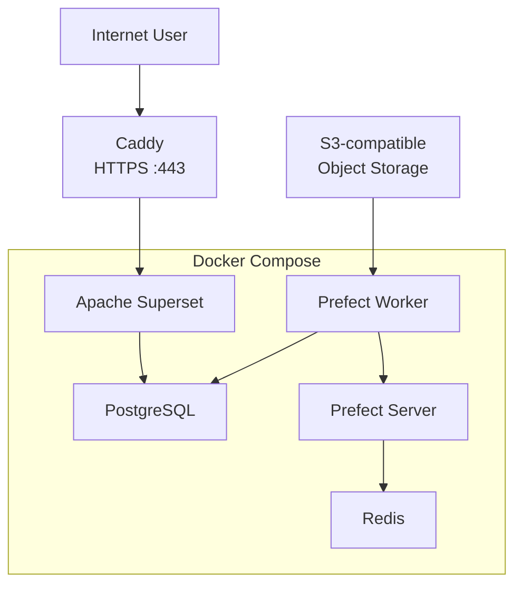

# VPS Deployment Guide


## 1. Overview

This guide describes how to deploy the Finance Analytics Platform from scratch on a clean Ubuntu VPS.

It covers the complete server deployment process, including:

- preparing the Ubuntu operating system
- installing Docker Engine and Docker Compose
- configuring secure access to GitHub
- cloning the project into the server filesystem
- creating runtime environment files and private dbt seeds
- building and starting the Docker Compose environment
- deploying the Prefect flow
- building and testing the dbt project
- restoring PostgreSQL and Superset data from backups
- configuring a domain, firewall, Caddy reverse proxy and HTTPS
- validating the complete production environment
- creating and restoring backups

After completing this guide, the server will run the following containerized services:

- PostgreSQL 16 as the analytical database and layered data warehouse
- Apache Superset as the BI and dashboard interface
- Prefect Server as the orchestration API and web interface
- Prefect Worker for scheduled ingestion and dbt execution
- Prefect PostgreSQL as the orchestration metadata database
- Redis as the Prefect messaging broker and cache

Superset will be published through Caddy over HTTPS.

PostgreSQL, Prefect and Superset will not be exposed directly to the public Internet. Public access will be provided only through the reverse proxy where required.


### 1.1 Intended Audience

This guide is intended for a person who has basic experience with:

- using a command-line interface
- connecting to a remote server through SSH
- working with Git repositories
- editing text configuration files
- understanding the basic purpose of Docker containers

Advanced Linux administration experience is not required.

Each command is explained in detail, including:

- what the command does
- why it is required
- what each argument and option means
- what changes it makes to the system
- what output should be expected
- what risks or side effects should be considered


### 1.2 Prerequisites

Before starting the deployment, the following resources are required.


#### Ubuntu VPS

A virtual private server with a supported Ubuntu Server release is required.

The server must provide:

- SSH access
- administrative privileges through `root` or `sudo`
- a public IPv4 or\and IPv6 address
- enough CPU, memory and disk space for the Docker Compose services


Recommended resources:

- **CPU:** 4 vCPUs
- **Memory:** 8 GB RAM
- **Storage:** 80 GB SSD

The exact Ubuntu version and available server resources will be checked before installation begins.


#### GitHub Repository Access

The server must be able to clone the Finance Analytics repository from GitHub.

The deployment uses an SSH connection to GitHub rather than authentication through a password.

The repository is expected to be cloned into:

```
/opt/finance_analytics
```


#### SSH Key for GitHub

A dedicated SSH key must be available on the VPS for repository access.

The private key remains on the server.

Only the public key is added to GitHub.

Private SSH keys, passwords, environment variables and other credentials must never be committed to the repository.


#### Runtime Secrets

The deployment requires credentials and configuration values for:

- PostgreSQL
- Superset
- Prefect
- S3-compatible object storage
- project database roles

These values are stored in:

```
infra/deploy/.env
```

**The `.env` file is excluded from version control and must not be committed.**


#### Private dbt Seeds

The standard project deployment requires a private account seed:

```
dbt/seeds/private/dim_accounts.csv
```

The optional public demo environment also requires:

```
dbt/seeds/private/category_mapping_demo.csv
```

These files contain user-specific mappings and are excluded from version control.

Public `.example` files are included in the repository and document the required structure.

The standard deployment requires `dim_accounts.csv`, while the additional category mapping is needed only when the optional demo environment is reproduced.


#### Domain Name

A domain name is not required for the initial Docker deployment.

The platform can first be started and tested directly on the VPS through local server interfaces and SSH port forwarding.

A domain becomes necessary when Superset is published on the Internet through Caddy with HTTPS.

The domain must eventually point to the public IP address of the VPS through DNS records.


### 1.3 Security Principles

This guide follows the following deployment principles:

- application credentials are stored outside Git
- PostgreSQL is not exposed directly to the Internet
- Superset remains bound to the server loopback interface
- external web traffic is handled through Caddy
- HTTPS certificates are issued and renewed automatically
- only required firewall ports are opened
- GitHub access uses an SSH key instead of a password
- persistent application data is stored in Docker volumes
- backups are created before destructive operations

Commands and configuration examples use placeholders for passwords, IP addresses and domains.

Real secrets must not be added to the documentation or committed to the repository.


### 1.3 Deployment Method

The deployment is performed incrementally.

Each section of this guide should be completed and verified before moving to the next section.

The recommended process is:

1. Read the complete section.
2. Execute its commands on the VPS.
3. Compare the actual output with the expected result.
4. Resolve any differences or errors.
5. Continue only after the current stage is working correctly.

This approach ensures that the documentation reflects the real deployment process rather than an untested theoretical configuration.


## 2. Deployment Architecture

The production deployment uses a single Ubuntu VPS.

Public HTTPS requests are accepted by Caddy and forwarded to Apache Superset running inside Docker.

The remaining platform services communicate through the internal Docker network and are not exposed directly to the Internet.



The deployment has two main layers:

- Caddy runs on the VPS and handles external HTTPS traffic
- Docker Compose manages the application containers

Caddy performs the following tasks:

- accepts requests on HTTPS port 443
- obtains and renews TLS certificates
- forwards requests to Superset
- hides the internal Superset port from the public Internet

Docker Compose manages the following services:

- PostgreSQL for analytical data and platform metadata
- Apache Superset for dashboards and data visualization
- Prefect Server for orchestration
- Redis for Prefect messaging and caching
- Prefect Worker for executing ingestion and dbt jobs

**Only Caddy should accept public web traffic.**

PostgreSQL, Redis and the internal Prefect services should remain available only inside the VPS and Docker network.


## 3. Server Preparation

This section prepares the Ubuntu VPS for Docker installation and project deployment.

The required checks are:

- Ubuntu version
- available system resources
- package updates
- reboot status
- timezone and clock synchronization


### 3.1 Check the Ubuntu Version

Run:

```
cat /etc/os-release
```

The command prints information about the installed operating system.

- `cat` displays the contents of a file
- `/etc/os-release` contains the operating system name and version

Check the following fields:

```
PRETTY_NAME
VERSION_ID
ID
```

The expected operating system is Ubuntu Server.

An Ubuntu LTS release is recommended because it receives long-term security updates.


### 3.2 Check Available Resources

Check the number of available CPU cores:

```
nproc
```

Check memory usage:

```
free -h
```

The most useful value is `available`, which shows how much memory can still be used by applications.

Check free disk space:

```
df -h /
```

The root filesystem will store:

- Docker images
- Docker volumes
- PostgreSQL data
- application logs
- database backups
- the project repository

The server must have enough free space for both the initial deployment and future data growth.


### 3.3 Update the Package Index

Run:

```
sudo apt update
```

A successful command should finish without repository or signature errors.


### 3.4 Install Available Updates

First review the available updates:

```
apt list --upgradable
```

Then install them:

```
sudo apt upgrade
```

The correct order is:

```
apt update
apt upgrade
```

`apt update` refreshes package information.

`apt upgrade` installs newer versions of already installed packages.

Ubuntu may ask for confirmation:

```
Do you want to continue? [Y/n]
```

Enter:

```text
Y
```

The upgrade may update:

- security libraries
- OpenSSH
- system services
- certificate packages
- Linux kernel packages

Some services may restart automatically.

Do not close the terminal while the upgrade is running.


### 3.5 Check Whether a Reboot Is Required

Run:

```
test -f /var/run/reboot-required && cat /var/run/reboot-required || echo "Reboot is not required"
```

The command checks whether Ubuntu created the reboot-required file after installing updates.

Possible output:

```
*** System restart required ***
```

or:

```
Reboot is not required
```

If a reboot is required, run:

```
sudo reboot
```

The SSH connection will close while the server restarts.

Reconnect to the VPS after it becomes available again.


### 3.6 Check the System Time

Run:

```
timedatectl
```

The command displays:

- current server time
- configured timezone
- clock synchronization status
- NTP service status

Correct time is important for:

- HTTPS certificates
- Docker registry connections
- GitHub SSH connections
- Prefect schedules
- PostgreSQL timestamps
- application logs
- backup timestamps

The recommended server timezone is UTC.

If server timezone is not UTC, set it with:

```
sudo timedatectl set-timezone UTC
```

Enable automatic time synchronization:

```
sudo timedatectl set-ntp true
```

Verify the result:

```
timedatectl
```

The expected values are:

```
Time zone: Etc/UTC
System clock synchronized: yes
NTP service: active
```

The exact timezone line may also be displayed as:

```
Time zone: UTC
```

### 3.7 Final Check

Run:

```
cat /etc/os-release
nproc
free -h
df -h /
timedatectl
```

The server preparation stage is complete when:

- Ubuntu is installed
- sufficient CPU resources are available
- sufficient memory is available
- sufficient disk space is available
- package updates are installed
- the server was restarted when required
- the timezone is set to UTC
- automatic time synchronization is active

The next section installs Docker Engine and Docker Compose.


## 4. Installing Docker

This section installs Docker Engine and Docker Compose from the official Docker repository

The official repository is used **instead** of:

```
sudo apt install docker.io
```

The Ubuntu package may contain an older Docker version and is maintained separately from the official Docker releases

The official repository provides:

- Docker Engine
- Docker command-line interface
- containerd runtime
- Docker Buildx
- Docker Compose plugin
- updates directly from Docker


### 4.1 Remove Conflicting Packages

Skip this step on a clean VPS where Docker has never been installed

If Docker or a compatible container runtime was installed earlier, remove conflicting packages:

```
for pkg in docker.io docker-doc docker-compose docker-compose-v2 podman-docker containerd runc; do
  sudo apt remove -y "$pkg"
done
```

This command does not remove Docker data stored in `/var/lib/docker`

Run it only after confirming that no existing containers or applications depend on the installed container runtime


### 4.2 Install Repository Requirements

Run:

```
sudo apt update
sudo apt install ca-certificates curl
```

The packages are required to:

- establish trusted HTTPS connections
- download the Docker signing key
- connect to the official Docker repository


### 4.3 Add the Docker Signing Key

Create the directory for repository keys:

```
sudo install -m 0755 -d /etc/apt/keyrings
```

Download the official Docker signing key:

```
sudo curl -fsSL https://download.docker.com/linux/ubuntu/gpg \
  -o /etc/apt/keyrings/docker.asc
```

Allow the package manager to read the key:

```
sudo chmod a+r /etc/apt/keyrings/docker.asc
```

The signing key allows Ubuntu to verify that Docker packages were published by Docker and were not modified after publication

Check the result:

```
ls -l /etc/apt/keyrings/docker.asc
```

Expected return:

```
-rw-r--r-- 1 root root ... /etc/apt/keyrings/docker.asc
```


### 4.4 Add the Official Docker Repository

Run:

```
sudo tee /etc/apt/sources.list.d/docker.sources > /dev/null <<EOF
Types: deb
URIs: https://download.docker.com/linux/ubuntu
Suites: $(. /etc/os-release && echo "${UBUNTU_CODENAME:-$VERSION_CODENAME}")
Components: stable
Architectures: $(dpkg --print-architecture)
Signed-By: /etc/apt/keyrings/docker.asc
EOF
```

The command creates:

```
/etc/apt/sources.list.d/docker.sources
```

The Ubuntu release name and processor architecture are detected automatically

Check the result:

```
cat /etc/apt/sources.list.d/docker.sources
```

Expected return:

```
Types: deb
URIs: https://download.docker.com/linux/ubuntu
Suites: <noble>
Components: stable
Architectures: <amd64>
Signed-By: /etc/apt/keyrings/docker.asc
```

Refresh the package index:

```
sudo apt update
```

The output should include the Docker repository without signature or repository errors


### 4.5 Install Docker Engine and Docker Compose

Run:

```
sudo apt install docker-ce docker-ce-cli containerd.io docker-buildx-plugin docker-compose-plugin
```

The installed packages are:

- `docker-ce` for Docker Engine
- `docker-ce-cli` for the Docker command-line interface
- `containerd.io` for the container runtime
- `docker-buildx-plugin` for image builds
- `docker-compose-plugin` for the `docker compose` command

Confirm the installation when requested

The Docker service normally starts automatically after installation


### 4.6 Check the Docker Service

Run:

```
sudo systemctl status docker --no-pager
```

The expected service state is:

```
Active: active (running)
```

If Docker is not running, start it:

```
sudo systemctl start docker
```

Enable automatic startup after a server reboot:

```
sudo systemctl enable docker
```

Docker normally starts automatically on Ubuntu after installation, but this command confirms that the service is enabled


### 4.7 Allow the Current User to Run Docker

Add the current Linux user to the `docker` group:

```
sudo usermod -aG docker "$USER"
```

Disconnect from the VPS and reconnect through SSH so the new group membership becomes active

Membership in the `docker` group grants permissions equivalent to administrative access

Only trusted administrative users should be added to this group

Verify group membership:

```
groups
```

The output should contain:

```
docker
```


### 4.8 Verify the Installation

Check the Docker version:

```
docker --version
```

Check the Docker Compose version:

```
docker compose version
```

**The project uses the modern Compose plugin:**

```
docker compose
```

**The legacy standalone command is not required:**

```
docker-compose
```

Run the Docker test container:

```
docker run --rm hello-world
```

Docker will:

- download the `hello-world` image
- create a temporary container
- run the container
- print a successful installation message
- remove the stopped container because `--rm` was specified

A successful output contains:

```
Hello from Docker!
```

After getting successful output delete `hello-world` image:

```
docker image rm hello-world:latest
```

### 4.9 Final Check

Run:

```
docker --version
docker compose version
docker info
```

Docker installation is complete when:

- Docker Engine is installed
- the Docker service is running
- the Docker service starts automatically
- the current user can run Docker without `sudo`
- Docker Compose is available
- the `hello-world` container runs successfully


## 5. Preparing the Project

This section prepares GitHub access and clones the Finance Analytics repository into the server filesystem

The project will be stored in:

```
/opt/finance_analytics
```

> [!IMPORTANT]
> Sections 5.3–5.6 describe how to configure a dedicated deployment SSH key for cloning the private Finance Analytics repository.
> If you are deploying from the public GitHub repository, skip directly to 5.7 Clone the Repository and use the repository URL appropriate for your preferred authentication method.


### 5.1 Install Git

Check whether Git is already installed:

```
git --version
```

Expected output:

```
git version 2.43.0
```

The exact version may differ

If Git is not installed, run:

```
sudo apt update
sudo apt install git
```

Confirm the installation:

```
git --version
```


### 5.2 Create the Project Directory

The project will be deployed under `/opt`

The `/opt` directory is intended for additional applications that are not part of the base operating system

Using `/opt/finance_analytics` keeps the project separate from:

- personal files in `/home`
- system configuration in `/etc`
- system packages in `/usr`
- temporary files in `/tmp`
- application logs in `/var/log`

Create the project directory:

```
sudo mkdir -p /opt/finance_analytics
```

The `-p` option creates missing parent directories and does not return an error if the directory already exists

Assign the directory to the current Linux user:

```
sudo chown "$USER":"$USER" /opt/finance_analytics
```

This allows the current user to clone and update the repository without running Git through `sudo`

Check the directory:

```
ls -ld /opt/finance_analytics
```

The owner and group should match the current Linux user

> [!IMPORTANT]
> The following sections configure access to a private GitHub repository using a dedicated deployment key.
> If you are deploying from the public repository, skip directly to **5.7 Clone the Repository**.


### 5.3 Create a Dedicated GitHub SSH Key

Check whether the server already has an SSH directory:

```
ls -la ~/.ssh
```

Create a dedicated key for the Finance Analytics repository:

```
ssh-keygen -t ed25519 -C "finance-analytics-vps" -f ~/.ssh/github_finance_analytics
```

The options are:

- `-t ed25519` creates a modern Ed25519 SSH key
- `-C` adds a descriptive comment to the public key
- `-f` specifies the key file path

The command creates two files:

```
~/.ssh/github_finance_analytics
~/.ssh/github_finance_analytics.pub
```

The file without `.pub` is the private key

The private key must remain on the VPS and must never be committed to Git or copied into the repository

The `.pub` file contains the public key that can be added to GitHub

When prompted for a passphrase, a passphrase can be configured for stronger protection

For unattended repository access, the key may be created without a passphrase


### 5.4 Add the Public Key to GitHub

Display the public key:

```
cat ~/.ssh/github_finance_analytics.pub
```

Copy the complete output and add it to the GitHub repository as a deploy key

In GitHub open:

```
Repository
Settings
Deploy keys
Add deploy key
```

Use a descriptive title such as:

```
Finance Analytics VPS
```

Write access is not required when the VPS only needs to clone and pull the repository

**The private key must not be added to GitHub**


### 5.5 Configure SSH for GitHub

Create or edit the SSH client configuration:

```
nano ~/.ssh/config
```

Add:

```
Host github.com
    HostName github.com
    User git
    IdentityFile ~/.ssh/github_finance_analytics
    IdentitiesOnly yes
```

This configuration tells SSH to use the dedicated deployment key when connecting to GitHub

Save the file and close the editor

Set secure permissions:

```
chmod 700 ~/.ssh
chmod 600 ~/.ssh/config
chmod 600 ~/.ssh/github_finance_analytics
chmod 644 ~/.ssh/github_finance_analytics.pub
```

SSH may reject private keys or configuration files that are accessible to other users


### 5.6 Test GitHub Access

Run:

```
ssh -T git@github.com
```

During the first connection, SSH may ask whether the GitHub host key should be trusted:

```
Are you sure you want to continue connecting
```

Confirm only after checking that the host is `github.com`

A successful authentication produces output similar to:

```
Hi w3llnamed! You've successfully authenticated, but GitHub does not provide shell access
```

The message confirms that:

- the SSH key is accepted
- the server can reach GitHub
- GitHub authentication is working
- shell access is intentionally unavailable


### 5.7 Clone the Repository

The project directory must be empty before cloning directly into it

Check its contents:

```
ls -la /opt/finance_analytics
```

If you completed the previous sections and configured a dedicated deployment SSH key, clone the private repository using SSH:

```
git clone git@github.com:<account>/finance_analytics.git /opt/finance_analytics
```

If you are deploying from the public repository, clone it using HTTPS:

```
git clone https://github.com/w3llnamed/finance_analytics.git /opt/finance_analytics
```

Both commands download the repository and place its contents directly into `/opt/finance_analytics`

Move into the project directory:

```
cd /opt/finance_analytics
```


### 5.8 Verify the Repository

Check the current repository state:

```
git status
```

Expected result:

```text
On branch main
Your branch is up to date with 'origin/main'

nothing to commit, working tree clean
```

Check the configured remote repository:

```
git remote -v
```

Expected remote:

```
git@github.com:<account>/finance_analytics.git
```

### 5.9 Verify the Project Structure

Run:

```
ls -la
```

The repository should contain the main project directories and files such as:

```
dbt
infra
ingestion
orchestration
docs
README.md
```

Check the deployment directory:

```
ls -la infra/deploy
```

The directory should contain the Docker Compose configuration and deployment-related files

At this stage, secret files such as `.env` and private dbt seeds may still be missing

They will be created in the next section


### 5.10 Updating the Repository Later

To download future changes, move into the repository:

```
cd /opt/finance_analytics
```

Check that there are no uncommitted changes:

```
git status
```

The working tree should normally be clean. Runtime configuration files such as .env and private dbt seeds are excluded from Git and therefore should not appear as modified.

Then update the current branch:

```
git pull --ff-only
```

The `--ff-only` option allows only a fast-forward update

It prevents Git from automatically creating a merge commit on the production server

The update should be stopped if local files tracked by Git were changed directly on the VPS

Runtime secrets and private data must remain in files excluded through `.gitignore`


### 5.11 Final Check

The project preparation stage is complete when:

- Git is installed
- `/opt/finance_analytics` belongs to the deployment user
- a dedicated GitHub SSH key exists
- the public key is registered in GitHub
- SSH authentication with GitHub succeeds
- the repository is cloned into `/opt/finance_analytics`
- the current branch is `main`
- the Git working tree is clean
- the remote repository uses the SSH URL
- the expected project directories are present

The next section creates the runtime `.env` file and prepares private dbt seeds


## 6. Runtime Configuration

This section creates the local runtime configuration required by Docker Compose, ingestion, dbt, Prefect and Superset

The following files contain deployment-specific or private values and are not stored in Git:

- `infra/deploy/.env`
- `dbt/seeds/private/dim_accounts.csv`
- `dbt/seeds/private/category_mapping_demo.csv` when the optional demo environment is used


### 6.1 Move to the Project Directory

Run:

```
cd /opt/finance_analytics
```

The following commands must be executed from the repository root unless another directory is specified

### 6.2 Create the Environment File

Create the runtime environment file from the public template:

```
cp infra/deploy/.env.example infra/deploy/.env
```

The command creates:

```
infra/deploy/.env
```

The `.env.example` file contains the required variable names and placeholder values

The new `.env` file will contain real credentials and must remain outside version control

Restrict access to the file:

```
chmod 600 infra/deploy/.env
```

This allows only the file owner to read and modify it


### 6.3 Configure Environment Variables

Open the file:

```
nano infra/deploy/.env
```

Replace every placeholder with the correct production value

The configuration includes values for:

- analytical PostgreSQL
- PostgreSQL service roles
- Superset
- Prefect
- S3-compatible object storage
- ingestion
- dbt

Use strong and unique passwords for different services and database roles

Do not use:

- example passwords from the template
- the same password for every role
- spaces around the `=` character
- quotes unless they are required as part of the value
- inline comments after secret values

A variable should normally use this format:

```
VARIABLE_NAME=value
```

Generate Strong Passwords

Production passwords can be generated directly on the server using the Linux cryptographic random number generator

Generate a 25-character password:

```
tr -dc 'A-Za-z0-9._-' < /dev/urandom | head -c 25
echo
```

The generated password may contain:

- uppercase Latin letters from `A` to `Z`
- lowercase Latin letters from `a` to `z`
- digits from `0` to `9`
- a period `.`
- an underscore `_`
- a hyphen `-`

These symbols are suitable for environment variables and normally do not require escaping in .env, Docker Compose, Bash, PostgreSQL connection settings, or application configuration

Replace every placeholder with generated password

Save the file in Nano:

- press `Ctrl+O`
- press `Enter`
- press `Ctrl+X`


### 6.4 Check for Unchanged Placeholders

Search the environment file for common placeholder values:

```
grep -nEi 'change|replace|example|placeholder|your_' infra/deploy/.env
```

Review every returned line

Some valid configuration values may contain words such as `example`, so the result must be checked manually rather than treated as an automatic error

**Do not print the complete `.env` file into shared terminals, screenshots, documentation or support messages because it contains secrets**


### 6.5 Create the Required Private dbt Seed

Create the private account seed from its template:

```
cp dbt/seeds/private/dim_accounts.csv.example \
   dbt/seeds/private/dim_accounts.csv
```

Open the created file:

```
nano dbt/seeds/private/dim_accounts.csv
```

Replace the example rows with the real account metadata and opening balances required by the project

The file is required for the standard private deployment

Its account identifiers must match the account values used by the source data and dbt models

Do not change the CSV header unless the project model and template are updated at the same time


### 6.6 Prepare the Optional Demo Seed

**Skip this step when the public demo environment is not required**

Create the private demo category mapping:

```
cp dbt/seeds/private/category_mapping_demo.csv.example \
   dbt/seeds/private/category_mapping_demo.csv
```

Open the file:

```
nano dbt/seeds/private/category_mapping_demo.csv
```

Replace the example rows with the required category mappings and masking parameters

The public demo account seed is already included in the repository:

```
dbt/seeds/private/dim_accounts_demo.csv
```

Its account identifiers must remain consistent with the identifiers in:

```
dbt/seeds/private/dim_accounts.csv
```


### 6.7 Verify the Required Files

Check the environment file:

```
ls -l infra/deploy/.env
```

Check the private seed directory:

```
ls -l dbt/seeds/private
```

For a standard private deployment, the following file must exist:

```
dbt/seeds/private/dim_accounts.csv
```

For the optional demo environment, the following files must also exist:

```
dbt/seeds/private/dim_accounts_demo.csv
dbt/seeds/private/category_mapping_demo.csv
```


### 6.8 Verify Git Protection

Run:

```
git status --short --ignored
```

The private files should appear with the ignored marker:

```
!! infra/deploy/.env
!! dbt/seeds/private/dim_accounts.csv
```

When the optional demo environment is configured, the result should also include:

```
!! dbt/seeds/private/category_mapping_demo.csv
```

Files beginning with `!!` are ignored by Git

They must not appear with markers such as:

```
??
A
M
```

**If a private file is not ignored, do not commit or push any changes until `.gitignore` is corrected**


### 6.9 Validate the Docker Compose Configuration

Run:

```
docker compose \
  --env-file infra/deploy/.env \
  -f infra/deploy/docker-compose.yml \
  config --quiet
```

The command:

- loads runtime values from `infra/deploy/.env`
- reads `infra/deploy/docker-compose.yml`
- resolves variables and service configuration
- validates the resulting Compose configuration
- prints nothing when the configuration is valid

A missing variable or invalid Compose configuration produces an error

This check does not build images or start containers

**Do not run `docker compose config` without `--quiet` in shared output because the expanded configuration may contain environment values**


### 6.10 Final Check

Runtime configuration is complete when:

- `infra/deploy/.env` exists
- every placeholder in `.env` has been reviewed
- `.env` permissions are restricted
- `dbt/seeds/private/dim_accounts.csv` contains the required account data
- optional demo seed files are prepared when needed
- private files are ignored by Git
- Docker Compose configuration validation finishes without errors

The next section builds and starts the platform with Docker Compose


## 7. Starting the Platform

This section builds the required Docker images and starts the Finance Analytics services

The commands must be executed from `/opt/finance_analytics/infra/deploy` directory :

```
cd /opt/finance_analytics/infra/deploy
```

### 7.1 Start the Docker Compose Stack

Run:

```
docker compose up -d --build
```

The command includes:

- `docker` runs the Docker command-line interface
- `compose` manages the services defined in the Compose file
- `up` creates and starts the configured services
- `-d` runs the containers in the background
- `--build` builds project images before starting the containers

> [!IMPORTANT]
> During the first startup, Docker downloads the required base images from Docker Hub
>
> If the server is not authenticated with Docker Hub, the download may fail with an HTTP `429 Too Many Requests` error due to Docker Hub rate limiting
>
> Authenticate Docker before running Docker Compose:
>
> ```
> docker login
> ```
>
> Open the displayed activation URL in a browser, sign in to Docker Hub and confirm the device code
>
> After a successful login, repeat the deployment command:
>
> ```
> docker compose up -d --build

Docker reuses images and image layers that were successfully downloaded before the failed attempt

Docker Hub authentication credentials are stored for the current Linux user and should not be committed to the repository

During the first startup, Docker may:

- download base images
- build custom images
- create an internal Docker network
- create persistent Docker volumes
- create containers
- initialize PostgreSQL databases
- initialize Superset
- start Prefect Server
- start Redis
- start Prefect Worker

The command may recreate containers when the Compose configuration or image definition has changed

Persistent data stored in Docker volumes is not deleted by this command

A successful command normally ends with messages showing that the required containers were created or started


### 7.2 Check Container Status

Run:

```
docker ps
```

The output shows:

- service name
- container name
- container state
- health status
- published ports

Long-running services should normally have one of the following states:

```
Up
```

or:

```
Up (healthy)
```

During the first startup, some services may temporarily appear as:

```
Up (starting)
```

or:

```
Up (unhealthy)
```

while completing their initialization

Wait a few minutes and check the container status again before investigating the issue

A container that remains in one of the following states requires investigation:

```
Restarting
Exited
Unhealthy
```

Some initialization containers may finish with exit code `0` after completing their task

This is normal only for services designed to run once and stop


### 7.3 Review Startup Logs

Display the latest logs from all services:

```
docker compose logs --tail=100
```

The `--tail=100` option limits the output to the latest 100 lines from each service

Review the output for:

- database initialization errors
- authentication failures
- missing environment variables
- permission errors
- unavailable dependencies
- failed database migrations
- repeated container restarts
- Python exceptions

Warnings do not always indicate a failed deployment

Errors that prevent a service from starting must be resolved before continuing

### 7.4 Verify Docker Resource Creation

Check the containers:

```
docker ps
```

Check the created volumes:

```
docker volume ls
```

Check the created networks:

```
docker network ls
```

The Finance Analytics containers, volumes and network should be present

Docker Compose adds a project prefix to generated resource names

The exact prefix depends on the Compose project configuration and deployment directory

### 7.5 Final Check

The platform startup stage is complete when:

- the Compose command finishes without a fatal error
- the required images are built or downloaded
- the required containers are running
- health checks pass where configured
- PostgreSQL remains running
- Superset remains running
- Prefect Server remains running
- Redis remains running
- Prefect Worker remains running
- logs do not contain unresolved startup errors
- persistent Docker volumes are present

The next section creates and verifies the Prefect deployment


## 8. Deploying Prefect

This section registers the project flow as a Prefect deployment

The deployment configuration is already defined in:

```
prefect.yaml
```

All Prefect commands are executed inside the `prefect-worker` container.

All commands must be executed from `/opt/finance_analytics/infra/deploy` directory

### 8.1 Check the Prefect Services

Run:

```
docker compose ps prefect-server prefect-services prefect-worker
```

The required services should be running

Check the worker logs:

```
docker compose logs --tail=50 prefect-worker
```

The logs should confirm that the worker connected to the Prefect API and started polling its work pool


### 8.2 Check the Work Pool

Run:

```
docker compose exec prefect-worker prefect work-pool ls
```

The project worker starts with a configured work pool name and worker type

When the pool does not yet exist, Prefect creates it automatically because the worker startup command includes the worker type

The work pool connects deployments to the worker that executes their flow runs


### 8.3 Check Existing Deployments

Run:

```
docker compose exec prefect-worker prefect deployment ls
```

On the first deployment, the table may be empty

This means that the Prefect server is available but the project flow has not yet been registered


### 8.4 Create the Deployment

Run:

```
docker compose \
  exec \
  -w /opt/finance_analytics \
  prefect-worker \
  prefect deploy --all
```

The command:

- runs the Prefect CLI inside the worker container
- uses `/opt/finance_analytics` as the working directory
- reads the deployment definitions from `prefect.yaml`
- registers every configured deployment in the Prefect server

The `--all` option deploys all definitions from `prefect.yaml` without requiring an interactive selection

Creating a deployment registers its schedule, entrypoint, work pool and execution configuration

It does not immediately execute the flow

A successful result should confirm creation or update of:

```
money-flow-s3-ingestion-flow/money-flow-ingestion
```

Running the command again updates the existing deployment instead of creating an additional copy


### 8.5 Verify the Deployment

Run:

```
docker compose exec prefect-worker prefect deployment ls
```

The output should now contain the deployment and its assigned work pool

#### Access the Prefect UI Through an SSH Tunnel

Prefect returns a URL that uses the internal Docker hostname:

```
http://prefect-server:4200
```

This address is available only inside the Docker network and cannot be opened directly from the local computer

The Prefect UI does not need to be exposed to the internet

To access the Prefect UI securely, create an SSH tunnel from the local computer to the Prefect Server running on the VPS

Run the following command in a local terminal, not inside the VPS:

```
ssh -N -L 4200:127.0.0.1:4200 <VPS host name>
```

The command includes:

- `ssh` establishes an SSH connection to the VPS
- `-N` creates the connection without opening a remote shell
- `-L` creates local port forwarding
- the first `4200` is the port opened on the local computer
- `127.0.0.1:4200` is the Prefect Server address on the VPS
- `<VPS host name>` is the SSH host alias or address used to connect to the VPS

Keep the terminal with the SSH connection open and open the following address in a local browser:

```
http://127.0.0.1:4200
```

To open a specific deployment directly, use its deployment ID:

```
http://127.0.0.1:4200/deployments/deployment/<deployment-id>
```

Replace `<deployment-id>` with the deployment ID returned by the `prefect deploy` command

Press:

```
Ctrl+C
```

in the terminal running the SSH tunnel to close the connection

Closing the SSH tunnel does not stop Prefect Server, Prefect Worker or scheduled flow runs on the VPS


### 8.6 Final Check

The Prefect deployment stage is complete when:

- Prefect Server is running
- Prefect Worker is running
- the worker is connected to the Prefect API
- the work pool exists
- `money-flow-ingestion` appears in the deployment list
- the deployment is assigned to the expected work pool
- the worker logs do not contain unresolved connection errors

The next section installs dbt dependencies and builds the warehouse


## 9. Building the Warehouse

This section installs dbt package dependencies and builds the analytical warehouse

All dbt commands are executed **inside the `prefect-worker` container** from the dbt project directory:

```
/opt/finance_analytics/dbt
```

### 9.1 Verify the dbt Project

Change directory:

```
cd /opt/finance_analytics/infra/deploy
```

Run:

```
docker compose \
  exec \
  -w /opt/finance_analytics/dbt \
  prefect-worker \
  dbt debug
```

The command verifies:

- access to `dbt_project.yml`
- access to the dbt profile
- PostgreSQL connection
- database credentials
- required configuration values

The command should finish with:

```
All checks passed
```

Do not continue until the database connection and dbt configuration are valid


### 9.2 Install dbt Dependencies

If the project contains a packages.yml (or dependencies.yml) file, install the required dbt packages:

```
docker compose \
  exec \
  -w /opt/finance_analytics/dbt \
  prefect-worker \
  dbt deps
```

**Projects that do not use external dbt packages can skip this step.**

The command reads:

```
packages.yml
```

and downloads the dbt packages required by the project

Dependencies must be installed before running the project because models, tests or macros may reference code provided by external packages

The downloaded packages are stored in the dbt packages directory configured by the project

A successful command finishes without package download or dependency resolution errors


### 9.3 Build the Warehouse

Run:

```
docker compose \
  exec \
  -w /opt/finance_analytics/dbt \
  prefect-worker \
  dbt build
```

The command performs the complete dbt build process

It may execute:

- seeds
- models
- snapshots when configured
- data tests
- unit tests when configured

The build order is determined automatically from the dbt dependency graph

Upstream models are created before downstream models that depend on them

The command also validates the resulting warehouse through the configured dbt tests


### 9.4 Review the Build Result

A successful build should finish with a summary similar to:

```
Done. PASS=... WARN=... ERROR=... SKIP=... TOTAL=...
```

The important result is:

```
ERROR=0
```

Warnings should be reviewed but do not always mean that the warehouse build failed

The build is not successful when the output contains unresolved errors such as:

- database authentication failures
- missing source tables
- missing private seeds
- insufficient database permissions
- SQL compilation errors
- failed dbt tests
- duplicate or null values prohibited by tests
- missing environment variables

Fix the reported problem and run `dbt build` again

### 9.5 Verify the Created Schemas

Run:

```
docker compose \
  --env-file infra/deploy/.env \
  -f infra/deploy/docker-compose.yml \
  exec postgres \
  psql \
  -U "$POSTGRES_USER" \
  -d "$POSTGRES_DB" \
  -c "\dn"
```

The output should contain the project schemas created by dbt, including:

```
raw
stg
core
dm
infra
```

Additional schemas may be present depending on the enabled demo configuration and PostgreSQL initialization scripts

### 9.6 Final Check

The warehouse build stage is complete when:

- `dbt debug` finishes successfully
- dbt dependencies are installed
- `dbt build` finishes with `ERROR=0`
- required seeds are loaded
- dbt models are created
- dbt tests pass
- the expected PostgreSQL schemas exist
- no unresolved permission or connection errors remain

The next section restores production data and verifies PostgreSQL roles and Superset metadata
