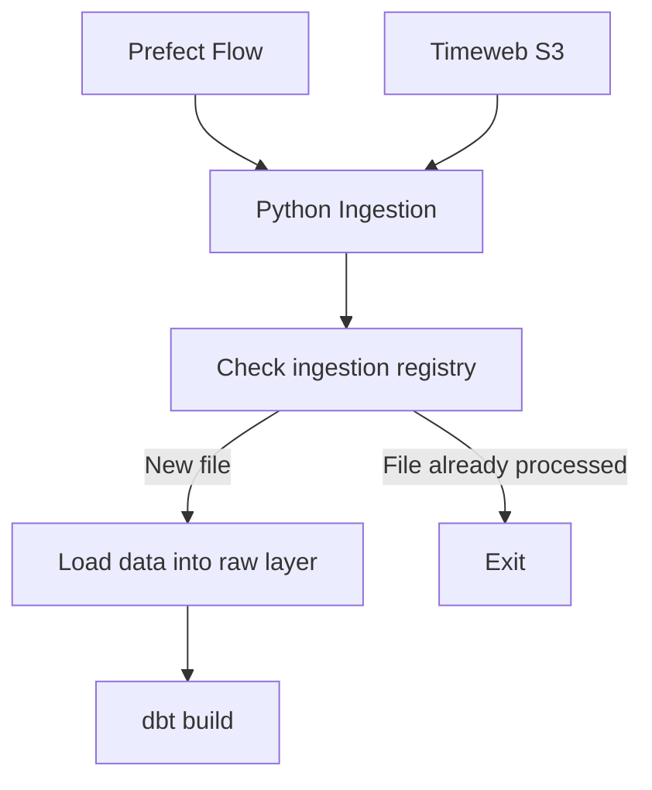

# Orchestration Layer

This directory contains Prefect-based workflow orchestration for the Finance Analytics Platform.

The orchestration layer coordinates ingestion and transformation processes while keeping business logic inside ingestion and dbt components.


## Overview

The orchestration layer is responsible for:

- scheduled pipeline execution
- S3 polling
- ingestion triggering
- dbt execution
- workflow monitoring and logging

The orchestration layer does not perform transformations itself. Its role is to coordinate execution of platform components.


## Architecture

Current orchestration flow:



The orchestration flow relies on ingestion metadata stored in PostgreSQL.


## Structure

```
orchestration/
├── README.md
└── flows/
    └── money_flow_s3_ingestion_flow.py
```

Project-level deployment configuration is stored in:

```
prefect.yaml
```


## Flow Logic

The current workflow performs the following steps:

1. Prefect starts the Python ingestion process.

2. The ingestion layer connects to S3-compatible object storage and determines the latest available Money Flow CSV file.

3. The ingestion layer checks `infra.ingestion_file_registry` to determine whether the file has already been successfully processed.

4. If the file has already been processed, ingestion returns skipped and the Prefect flow exits without running dbt.

5. If the file is new, the ingestion layer loads it into PostgreSQL and records ingestion metadata.

6. After successful ingestion, Prefect executes dbt transformations and tests.

7. Prefect records the workflow execution status and logs.


## Scheduling

Deployments are configured through Prefect.

Current schedule:

```
interval: 300
```

The flow runs every 5 minutes.

Deployment configuration is stored in:

```
prefect.yaml
```


## Deployment

Create or update the deployment from inside the running Prefect Worker
container:

```
docker exec -it \
  -w /opt/finance_analytics \
  prefect-worker \
  prefect deploy
```

The deployment configuration is read from the project-level `prefect.yaml` file.

The Prefect Worker is started automatically as part of the Docker Compose environment.

It connects to Prefect Server, creates the `finance-process-pool` work pool if necessary and continuously polls it for scheduled flow runs.

For more details, see `infra/README.md`


## Accessing the Prefect UI on a VPS

When the platform is deployed on a VPS, the Prefect UI is not exposed to the internet

Inside the Docker network, Prefect is available at:

```
http://prefect-server:4200
```

The hostname `prefect-server` is available only to containers connected to the Docker network and cannot be opened directly from the local computer.

The Prefect Server port is bound to the VPS loopback interface, so the UI can be accessed securely through an SSH tunnel

Run the following command on the local computer, not on the VPS:

```
ssh -N -L 4200:127.0.0.1:4200 <ssh-host>
```

Replace `<ssh-host>` with the SSH host alias or address normally used to connect to the VPS

Keep the SSH connection open and navigate to:

```
http://127.0.0.1:4200
```

Port `4200` is the default Prefect Server port

The two occurrences of `4200` in the SSH command have different meanings:

* the first `4200` is the port opened on the local computer
* the second `4200` is the Prefect Server port available on the VPS

The local port can be changed if port `4200` is already in use

For example:

```
ssh -N -L 14200:127.0.0.1:4200 <ssh-host>
```

In this case, open:

```
http://127.0.0.1:14200
```

Press `Ctrl+C` in the local terminal to close the SSH tunnel

Closing the tunnel only closes local access to the UI and does not stop Prefect Server, Prefect Worker or scheduled flow runs on the VPS


## Docker Integration

Prefect workers are deployed using a dedicated Docker image:

```
infra/deploy/prefect-worker.Dockerfile
```

The image contains:

- Python runtime
- ingestion dependencies
- dbt dependencies
- Prefect runtime


## Idempotency

The orchestration layer is designed to prevent duplicate processing.

Before executing ingestion, the flow verifies whether the source file has already been registered in:

```
infra.ingestion_file_registry
```

If the file is already registered, the flow exits without loading data or executing dbt.


## Monitoring

Pipeline execution history is available through Prefect.

Typical monitoring information includes:

- flow status
- execution duration
- failure logs
- retry history
- deployment schedule status


## Future Improvements

Potential future enhancements:

- Telegram notifications for pipeline failures and data quality issues
- anomaly-based alerting
- support for multiple ingestion pipelines
- event-driven pipeline execution
